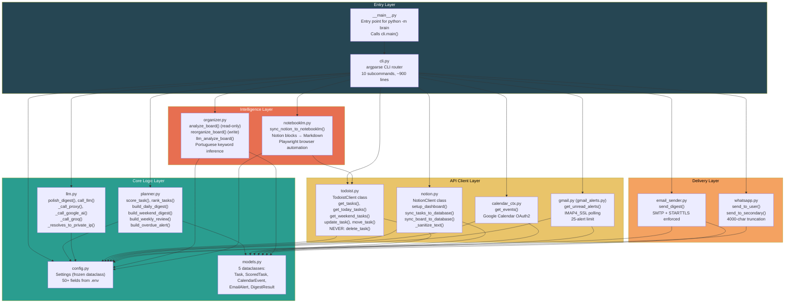
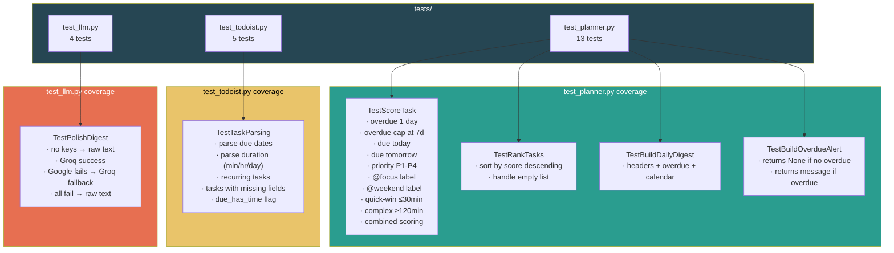
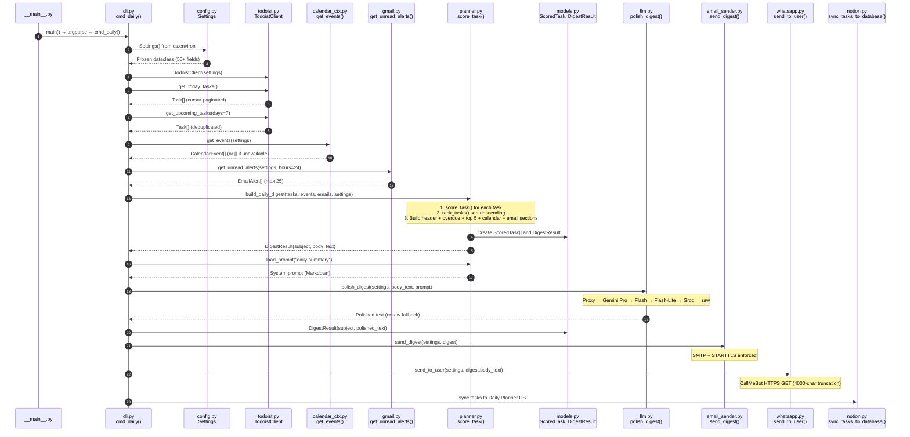
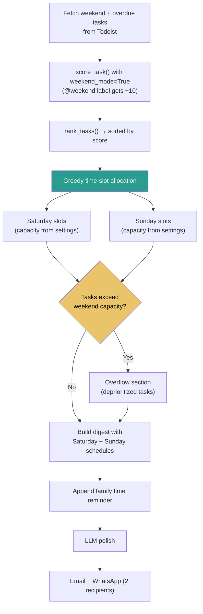
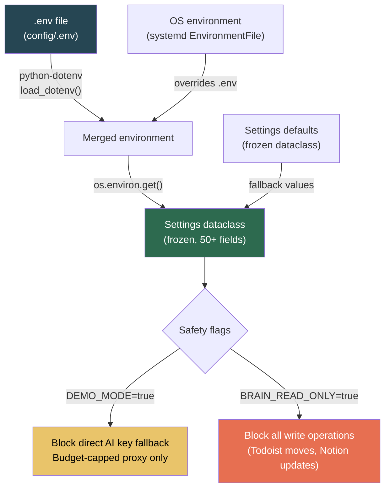

# VelaFlow — Code-Level Architecture (Engineering Reference)

> This document maps every source file to its role, key functions, and how they
> connect. Feed this to NotebookLM alongside `architecture-visual.md` to
> generate targeted technical review questions.

---

## 1. Module Dependency Graph (with key functions)



---

## 2. File-by-File Reference

### `__main__.py` — Entry point

```python
# What it does: allows `python -m brain` to work
from brain.cli import main
main()
```

**Design rationale:** *Why use `__main__.py` instead of a script entry point?*
> It lets users run the package with `python -m brain` without installing it.
> The `pyproject.toml` also defines a `brain` console script via
> `[project.scripts]` for installed environments.

---

### `cli.py` — Command router (~900 lines)

**Key functions:**

| Function | Lines | What it does |
|----------|-------|-------------|
| `main()` | Entry | Parses args, loads Settings, dispatches to `cmd_*` |
| `cmd_daily()` | ~80 | Fetch tasks + events + emails → score → digest → LLM → deliver |
| `cmd_weekend()` | ~80 | Weekend tasks → capacity-aware allocation → LLM → deliver |
| `cmd_weekly()` | ~60 | Active + completed → velocity comparison → LLM coaching |
| `cmd_alerts()` | ~30 | Overdue tasks → WhatsApp (skip if none) |
| `cmd_analyze()` | ~40 | Board health analysis (read-only) + optional LLM deep dive |
| `cmd_organize()` | ~50 | Reorganize board (dry-run or --apply) |
| `cmd_notion_setup()` | ~30 | One-time: create planner sections + Notion dashboards |
| `cmd_notion_sync()` | ~40 | Two-way sync planner DBs + optional full board |
| `cmd_notion_rebuild()` | ~20 | Rebuild Command Center layout (data preserved) |
| `cmd_notebooklm_sync()` | ~30 | Notion pages → NotebookLM sources |
| `_get_calendar_events()` | Helper | Safe import of optional calendar module |
| `_setup_logging()` | Helper | Configure structured logging |
| `_send_digest()` | Helper | Email + optional WhatsApp delivery |

**Key pattern — safe optional imports:**
```python
def _get_calendar_events(settings, start=None, end=None):
    try:
        from brain.calendar_ctx import get_events
        return get_events(settings, start=start, end=end)
    except Exception:
        logger.info("Calendar events unavailable.")
        return []
```

**Design rationale:** *Why lazy-import calendar_ctx instead of a top-level import?*
> Google Calendar requires `google-api-python-client` and OAuth2 credentials.
> By deferring the import, the system works without those dependencies —
> calendar context is optional, not required.

---

### `config.py` — Settings dataclass

**Key design:**
```python
@dataclass(frozen=True)
class Settings:
    # AI / LLM
    litellm_proxy_url: str = ""
    litellm_proxy_token: str = ""
    google_ai_api_key: str = ""
    groq_api_key: str = ""
    groq_model: str = "llama-3.3-70b-versatile"

    # Safety flags
    demo_mode: bool = False        # Blocks direct key fallback
    brain_read_only: bool = False  # Blocks all write operations

    # Todoist
    todoist_api_token: str = ""
    todoist_project_name: str = "2nd-Brain"
    todoist_focus_label: str = "focus"
    todoist_weekend_label: str = "weekend"

    # ... 40+ more fields loaded from os.environ
```

**Design rationale:** *Why frozen=True?*
> Immutability. Settings are loaded once at startup and never modified. A frozen
> dataclass prevents accidental mutation and communicates intent — configuration
> is read-only state.

**Design rationale:** *Why not use pydantic?*
> Minimal dependencies. `dataclasses` is stdlib. For a CLI tool that loads flat
> environment variables, pydantic's validation overhead adds dependency weight
> without proportional benefit.

---

### `models.py` — Data structures

```python
@dataclass
class Task:
    id: str
    content: str
    priority: int = 1          # Todoist: 1=none, 4=urgent (inverted!)
    labels: list[str] = field(default_factory=list)
    due_date: date | None = None
    due_has_time: bool = False
    duration_minutes: int | None = None
    section_name: str = ""
    is_recurring: bool = False
    # ... more fields

@dataclass
class ScoredTask:
    task: Task
    score: int = 0
    reasons: list[str] = []    # Human-readable scoring breakdown

@dataclass
class DigestResult:
    subject: str
    body_text: str
    body_html: str = ""
```

**Design rationale:** *Why does ScoredTask wrap Task instead of inheriting from it?*
> Composition over inheritance. `ScoredTask` adds scoring metadata (score,
> reasons) without modifying the Task contract. This keeps Task a pure data
> representation of a Todoist task.

**Design rationale:** *Todoist priority is inverted (4=urgent, 1=none). How do you handle that?*
> The scoring function maps it explicitly:
> `priority_points = {4: 18, 3: 10, 2: 4, 1: 0}`.
> The model stores the raw Todoist value; the business logic in planner.py
> translates it.

---

### `planner.py` — Scoring engine (~500 lines)

**Key functions:**

| Function | What it does |
|----------|-------------|
| `score_task(task, settings, weekend_mode)` | Deterministic point-based scoring |
| `rank_tasks(tasks, settings, weekend_mode)` | Score all → sort descending → tiebreak |
| `build_daily_digest(tasks, events, emails, settings)` | Top 5 + overdue + calendar + email context |
| `build_weekend_digest(tasks, events, settings)` | Greedy time-slot allocation (capacity-aware) |
| `build_weekly_review(active, completed, settings)` | Velocity comparison + streak tracking |
| `build_overdue_alert(tasks, settings)` | Simple overdue list for WhatsApp |
| `load_prompt(name)` | Load Markdown prompt from `prompts/` directory |

**Core scoring logic (simplified):**
```python
def score_task(task, settings, weekend_mode=False):
    score = 0
    reasons = []

    # Overdue: +20/day, max 7 days = +140
    if task.due_date and task.due_date < today:
        days = min((today - task.due_date).days, 7)
        score += days * 20

    # Due today: +25
    elif task.due_date == today:
        score += 25

    # Priority: P1=+18, P2=+10, P3=+4
    score += {4: 18, 3: 10, 2: 4, 1: 0}[task.priority]

    # Labels: @focus=+14, @weekend=+10 (weekend only)
    if "focus" in task.labels: score += 14
    if weekend_mode and "weekend" in task.labels: score += 10

    # Duration: ≤30min=+4, ≥120min=-6
    if task.duration_minutes and task.duration_minutes <= 30: score += 4
    if task.duration_minutes and task.duration_minutes >= 120: score -= 6

    # Backlog penalty: no date + no focus = -4
    if not task.due_date and "focus" not in task.labels: score -= 4

    return ScoredTask(task=task, score=score, reasons=reasons)
```

**Design rationale:** *Why is the scoring deterministic instead of ML-based?*
> Three reasons: (1) Reproducibility — same input always produces same output,
> making debugging trivial. (2) Auditability — the `reasons` list explains every
> point, so the user can verify the ranking. (3) Reliability — if all LLMs fail,
> the deterministic ranking still produces a usable digest.

**Design rationale:** *Why cap overdue at 7 days?*
> Diminishing returns. A task 30 days overdue is not meaningfully more urgent
> than one 7 days overdue — both are critical. The cap prevents ancient overdue
> tasks from permanently dominating the ranking.

---

### `llm.py` — AI fallback chain

**Key functions:**

| Function | What it does |
|----------|-------------|
| `polish_digest(settings, raw_text, prompt)` | Main entry: tries proxy → Google → Groq → raw |
| `call_llm(settings, text, prompt, prefer_quality)` | Generic LLM call (used by organizer) |
| `_call_proxy(settings, text, prompt)` | LiteLLM proxy via OpenAI-compatible API |
| `_call_google_ai(settings, text, prompt, model)` | Google AI Studio REST API |
| `_call_groq(settings, text, prompt)` | Groq OpenAI-compatible API |
| `_gemini_model_chain(settings)` | Returns [Pro, Flash, Flash-Lite] |
| `_resolves_to_private_ip(hostname)` | SSRF protection: blocks RFC 1918 addresses |

**SSRF guard (security-critical):**
```python
def _resolves_to_private_ip(hostname: str) -> bool:
    """Block SSRF: prevent proxy URL from resolving to private networks."""
    try:
        for info in socket.getaddrinfo(hostname, None):
            addr = info[4][0]
            if ipaddress.ip_address(addr).is_private:
                return True
    except socket.gaierror:
        return True  # DNS failure = block (fail-closed)
    return False
```

**Design rationale:** *Why check for private IP resolution on the proxy URL?*
> SSRF prevention. If an attacker controls the `LITELLM_PROXY_URL` config
> value, they could point it to `127.0.0.1` or an internal network address to
> probe internal services. The guard resolves the hostname and blocks any
> RFC 1918 or loopback address. It fails closed — DNS errors are blocked too.

**Design rationale:** *Why use an OpenAI-compatible API format for all providers?*
> Uniform interface. LiteLLM proxy, Google AI (via the proxy), and Groq all
> accept the same `POST /chat/completions` format. This means the fallback
> chain can reuse the same request structure — only the URL and auth header
> change.

---

### `todoist.py` — API client (delete-protected)

**Key design decisions:**

```python
class TodoistClient:
    def __init__(self, settings: Settings):
        self.base_url = "https://api.todoist.com/api/v1"
        self.headers = {"Authorization": f"Bearer {settings.todoist_api_token}"}

    def get_tasks(self, project_id=None, section_id=None):
        """Cursor-paginated task fetch."""
        tasks = []
        cursor = None
        while True:
            params = {"project_id": project_id, "cursor": cursor}
            resp = requests.get(f"{self.base_url}/tasks", headers=self.headers, params=params)
            data = resp.json()
            tasks.extend([self._parse_task(t) for t in data["results"]])
            cursor = data.get("next_cursor")
            if not cursor:
                break
        return tasks

    # SAFETY: These methods are intentionally NOT implemented
    # def delete_task(self, task_id): ...  # NEVER
    # def close_task(self, task_id): ...   # NEVER
```

**Design rationale:** *Why cursor pagination instead of offset-based?*
> Todoist API v1 uses cursor pagination natively. Cursor pagination is more
> reliable for large datasets — it doesn't suffer from the "shifting window"
> problem where items are missed or duplicated when the underlying data changes
> between pages.

**Design rationale:** *Why permanently disable delete and close operations?*
> Safety-first design. This CLI manages a user's real task list. An accidental
> deletion or completion is difficult to undo. The delete-protection is not a
> config flag — it's a code-level decision. The methods don't exist, so they
> can't be called by mistake.

---

### `notion.py` — Dashboard builder + sync (~800 lines)

**Key patterns:**

| Function | What it does |
|----------|-------------|
| `setup_dashboard()` | One-time: create root page, Command Center, 4 planner DBs |
| `sync_tasks_to_database()` | Upsert tasks from Todoist section → Notion DB |
| `sync_board_to_database()` | Full board snapshot → Notion task board DB |
| `_reverse_sync()` | Notion-only tasks → Todoist (two-way) |
| `_sanitize_text(text)` | Remove control chars, enforce 2000-char Notion limit |
| `_heading()`, `_paragraph()`, `_callout()` | Block builder helpers (12+ methods) |

**Design rationale:** *How do you handle the Notion 2000-character block limit?*
> `_sanitize_text()` strips control characters, truncates at 2000 chars, and
> appends "..." if truncated. Every text block passes through this before
> being sent to the API.

---

### `organizer.py` — Board intelligence

**Key design — Portuguese keyword inference:**
```python
LABEL_KEYWORDS = {
    "Manutenção":    ["limpeza", "reparar", "aspirador", "filtro", ...],
    "Tecnologia":    ["raspberry", "proxmox", "vpn", "servidor", ...],
    "Finanças":      ["banco", "fatura", "impostos", "seguro", ...],
    "Saúde":         ["médico", "dentista", "farmácia", "ginásio", ...],
    "Lojas":         ["comprar", "encomendar", "devolver", "amazon", ...],
    "Entretenimento":["filme", "série", "jogo", "spotify", ...],
    # ... more categories
}
```

**Design rationale:** *Why Portuguese keywords?*
> The user's Todoist tasks are in Portuguese. The keyword inference uses the
> actual language of the data. This is a practical design decision — not a
> limitation. The keyword dictionary could be extended or made configurable.

---

### `email_sender.py` — SMTP delivery

**Security-critical pattern:**
```python
def send_digest(settings, digest):
    with smtplib.SMTP(settings.smtp_host, settings.smtp_port) as server:
        server.starttls()  # STARTTLS enforced before credentials
        server.login(settings.smtp_username, settings.smtp_password)
        server.send_message(msg)
```

**Design rationale:** *Why enforce STARTTLS before login?*
> Without STARTTLS, credentials are sent in plaintext over the network. The
> SMTP protocol starts unencrypted — STARTTLS upgrades the connection to TLS
> before any authentication happens. This is a defense-in-depth measure.

---

### `gmail.py` — IMAP polling

```python
def get_unread_alerts(settings, hours=24):
    """Poll Gmail for unread important emails (last N hours)."""
    with imaplib.IMAP4_SSL(settings.imap_host) as mail:
        mail.login(settings.imap_user, settings.imap_password)
        mail.select("INBOX")
        # IMAP SEARCH for UNSEEN messages since cutoff
        # Returns up to 25 EmailAlert objects
```

**Design rationale:** *Why a 25-alert limit?*
> Pragmatic cap. The daily digest includes an email summary section. More than
> 25 emails would make the digest unreadably long and slow down the IMAP fetch.

---

### `whatsapp.py` — CallMeBot integration

```python
def send_to_user(settings, message):
    """Send WhatsApp message via CallMeBot (4000-char max)."""
    text = message[:4000]  # CallMeBot API limit
    url = f"https://api.callmebot.com/whatsapp.php"
    params = {"phone": settings.callmebot_phone, "text": text, "apikey": settings.callmebot_api_key}
    requests.get(url, params=params)
```

---

### `calendar_ctx.py` — Google Calendar (optional)

```python
def get_events(settings, start=None, end=None):
    """Fetch events from Google Calendar via OAuth2."""
    # Uses google-api-python-client
    # Handles token refresh automatically
    # Returns list[CalendarEvent]
```

---

### `notebooklm.py` — NotebookLM sync (Playwright)

```python
def sync_notion_to_notebooklm(settings, rebuild=True):
    """Pull all Notion pages → convert to Markdown → push to NotebookLM."""
    # 1. Fetch all Notion pages (recursive block extraction)
    # 2. Convert Notion blocks → Markdown format
    # 3. Fetch active Todoist tasks → Markdown
    # 4. Bundle into 7 source documents
    # 5. Push to NotebookLM via notebooklm-py (Playwright browser automation)
    # 6. Optionally rebuild (delete old sources first)
```

**Design rationale:** *Why Playwright instead of an API?*
> NotebookLM has no official API. The `notebooklm-py` library uses Playwright
> to drive a headless Chromium browser, authenticated with exported Google
> session cookies. It's fragile by design — Google can change the UI — but it's
> the only option available.

---

## Enterprise Modules (v2.0)

### catalog/models.py

Domain models for the on-prem local data catalog.

- `CatalogNamespace` — top-level isolation boundary
- `CatalogSchema` — logical grouping (bronze/silver/gold)
- `CatalogTable` — registered table with column definitions and row count
- `ColumnDef` — column name + type definition
- `CatalogGrant` — role→schema→level access grant
- `GrantLevel` — enum: SELECT, INSERT, UPDATE, DELETE, ALL
- `LineageRecord` — pipeline stage provenance record

### catalog/store.py

SQLite-backed catalog with RBAC and lineage tracking.

- `CatalogStore(db_path)` — creates hardened SQLite database
- `_harden()` — WAL mode, foreign keys, secure_delete, file permissions 0600
- Namespace/Schema/Table CRUD operations
- `grant_access()` / `check_access()` / `revoke_access()` — RBAC at schema level
- `record_lineage()` / `get_lineage()` / `get_full_lineage()` — provenance tracking
- `bootstrap_velaflow()` — creates default namespace + bronze/silver/gold schemas + role grants

### engine/connection.py

DuckDB connection factory with memory safety.

- `DuckDBEngine(db_path, memory_limit, read_only)` — configurable analytical engine
- Memory limit default 512 MB (`DUCKDB_MEMORY_LIMIT` env var)
- Thread limit: 2 (resource-constrained environments)
- File permissions: 0600 on database files
- Methods: `execute()`, `query()`, `query_scalar()`, `table_exists()`, `close()`

### engine/processor.py

SQL-based medallion pipeline running in-process on DuckDB.

- `MedallionProcessor(engine, catalog, namespace)` — orchestrates DuckDB transforms
- `initialize()` — creates bronze_tasks, silver_tasks, gold_scored_tasks tables
- `bronze_ingest(tenant_id, source, records)` — INSERT raw records
- `silver_transform(tenant_id)` — ROW_NUMBER dedup, MD5 hash, empty content filter
- `gold_enrich(tenant_id, scored_tasks)` — persist pre-scored tasks
- `gold_query(tenant_id, top_n)` — top-N query ordered by score
- All operations record lineage and update catalog stats

### security/zero_trust.py

Zero-trust enforcement for inter-component security.

- `RequestSigner(secret)` — HMAC-SHA256 signing with nonce + timestamp (5-min window)
- `AuditLogger(component)` — structured security event logging
- `InputSanitizer` — input validation at all system boundaries

---

## 3. Test Architecture



---

## 4. Data Flow Through the Codebase (Daily Briefing — file by file)



---

## 5. Weekend Planner — Capacity-Aware Allocation



---

## 6. Prompt Engineering

Each CLI command loads a specific Markdown prompt from `prompts/`:

| File | Used by | Purpose |
|------|---------|---------|
| `daily-summary.md` | `cmd_daily()` | Role: productivity coach. Output: structured briefing with priorities. |
| `weekend-planner.md` | `cmd_weekend()` | Role: weekend scheduler. Output: Saturday + Sunday time-blocked plan. |
| `weekly-review.md` | `cmd_weekly()` | Role: weekly coach. Output: velocity analysis + next-week recommendations. |
| `task-prioritization.md` | `cmd_analyze()` | Role: Kanban consultant. Output: board health insights + action items. |

**Key prompt design pattern:**
```markdown
You are a productivity assistant for a software engineer.

## Input
You will receive a raw task digest with scores and reasoning.

## Output Format
Return a structured briefing with:
1. Top 5 priorities (with reasoning)
2. Overdue items requiring immediate action
3. Calendar conflicts to resolve
4. Quick wins (< 30 min) for momentum

## Constraints
- Do not invent tasks
- Do not remove any task from the list
- Preserve the original scoring order
```

**Design rationale:** *Why separate prompt files instead of inline strings?*
> Separation of concerns. Prompts are iterated independently of code. A prompt
> change doesn't require a code deployment — just edit the Markdown file and
> the next timer run picks it up.

---

## 7. Configuration Hierarchy



**Design rationale:** *What's the difference between DEMO_MODE and BRAIN_READ_ONLY?*
> `DEMO_MODE` restricts the AI path — no direct key fallback, only the
> budget-capped proxy. `BRAIN_READ_ONLY` restricts the data path — no writes
> to Todoist or Notion. They're independent flags. A demo container uses both;
> a developer testing locally might use `BRAIN_READ_ONLY` alone.

---

## 8. Round 10-12 Enterprise Modules

### `rag.py` — RAG Pipeline (DuckDB Vector Search)

| Class | What it does |
|-------|-------------|
| `DocumentChunker` | Sentence-aware splitting with configurable `chunk_size` / `chunk_overlap` |
| `SimpleEmbedder` | Lightweight cosine-similarity embedder (no external deps) |
| `VectorStore` | DuckDB-backed vector storage, tenant-scoped isolation |
| `RAGPipeline` | End-to-end: ingest → chunk → embed → store; query → embed → search → return |

| Function | What it does |
|----------|-------------|
| `RAGPipeline.ingest()` | Chunk document → embed → store vectors with metadata |
| `RAGPipeline.query()` | Embed question → cosine search → top-K results |
| `RAGPipeline.augment_prompt()` | Inject retrieved context into LLM system prompt |
| `RAGPipeline.delete_document()` | Remove all vectors for a document |
| `RAGPipeline.purge_tenant()` | Delete all vectors for a tenant (GDPR) |

---

### `llm_local.py` — Ollama Local LLM Client

| Class | What it does |
|-------|-------------|
| `LocalLLMClient` | HTTP client for Ollama `/api/chat` and `/api/embeddings` |
| `HardwareProfile` | Detected GPU/CPU capabilities, recommended model selection |

| Function | What it does |
|----------|-------------|
| `chat(prompt, system_prompt)` | OpenAI-style chat completion via local Ollama |
| `embed(text)` | Generate embeddings via `/api/embeddings` |
| `detect_hardware()` | Probe `nvidia-smi`; select GPU or CPU model |

---

### `tenant/demo_manager.py` — Demo Account Lifecycle

| Class | What it does |
|-------|-------------|
| `DemoManager` | Create time-limited VIP accounts, check expiry, enforce cost caps |

| Function | What it does |
|----------|-------------|
| `create_demo()` | Provision VIP tenant with TTL + cost caps |
| `is_expired()` | Check if demo TTL has elapsed |
| `check_cost_cap()` | Raise exception if usage exceeds cost ceiling |
| `get_usage_analytics()` | Structured usage report (API calls, costs) |
| `list_demos()` | List all demo accounts with status |

---

### `security/audit_log.py` — Encrypted Tamper-Evident Audit Logging

| Class | What it does |
|-------|-------------|
| `AuditLog` | Per-tenant encrypted log with SHA-256 HMAC chain |
| `AuditEntry` | Dataclass: timestamp, tenant_id, user_id, action, resource, detail, chain_hash |

| Function | What it does |
|----------|-------------|
| `log()` | Write encrypted entry + HMAC chain link |
| `read()` | Decrypt and return entries for a tenant |
| `verify_chain()` | Validate HMAC chain integrity; detect tampering |
| `purge()` | Delete all audit entries for a tenant (compliance) |

---

## 9. Key Design Patterns Summary

| Pattern | Where | Why |
|---------|-------|-----|
| **Composition over inheritance** | `ScoredTask` wraps `Task` | Keeps data models clean, adds metadata without modifying contracts |
| **Frozen dataclass** | `Settings` | Immutable configuration, communicates read-only intent |
| **Cursor pagination** | `TodoistClient.get_tasks()` | Reliable for large datasets, handles concurrent data changes |
| **Fallback chain** | `polish_digest()` | Graceful degradation: best → cheapest → raw |
| **Delete protection** | `TodoistClient` | Safety by omission — dangerous methods don't exist |
| **SSRF guard** | `_resolves_to_private_ip()` | Fail-closed DNS resolution check on proxy URL |
| **Safe optional imports** | `_get_calendar_events()` | System works without optional dependencies |
| **Idempotent sync** | `notion.py` two-way sync | Safe to re-run, no duplicates, stateless |
| **Structured prompts** | `prompts/*.md` | Iterate prompts independently of code |
| **Multi-channel delivery** | Email + WhatsApp + Notion | Redundancy against single-point failures |
| **Budget-capped tokens** | Zero-Trust Proxy | Limit blast radius of credential theft |
| **Persistent timers** | systemd `Persistent=true` | Catch missed runs after downtime |

