# VelaFlow Enterprise Architecture

> Multi-tenant distributed medallion architecture with JWT authentication, RBAC, field-level
> encryption, DuckDB analytical engine, SQLite data catalog, zero-trust inter-component security,
> and auto-scaling deployment — fully on-prem, no cloud dependency.

---

## System Overview

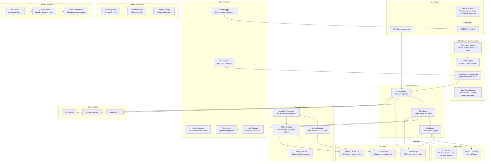

---

## Medallion Architecture

### Bronze Layer (`src/brain/pipeline/bronze.py`)

Raw data lands exactly as received from external APIs. No transformation, no cleaning.

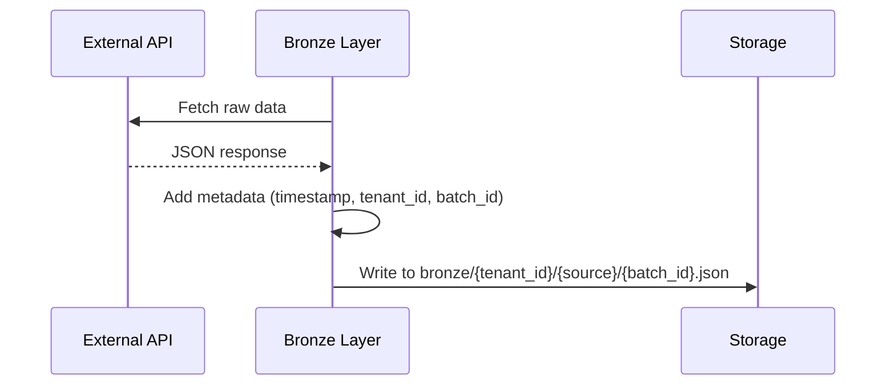

**Design principles:**
- Data is immutable once written
- Tenant-partitioned by directory structure
- Batch IDs enable replay and audit
- No schema enforcement — schema is applied at Silver

**Sources:**
| Source | Method | Data |
|--------|--------|------|
| Todoist | `ingest_todoist(tasks)` | Raw task objects |
| Calendar | `ingest_calendar(events)` | Raw calendar events |
| Gmail | `ingest_gmail(emails)` | Raw email metadata |

### Silver Layer (`src/brain/pipeline/silver.py`)

Cleans, validates, deduplicates, and masks PII.

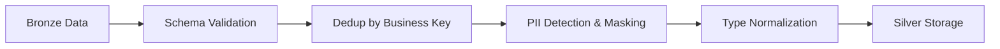

**Processing steps:**
1. **Schema validation** — Required fields enforced per source type
2. **Deduplication** — Business key extraction (task ID, event ID, message ID)
3. **PII masking** — Automatic scanning and replacement before persistence
4. **Type normalization** — Date parsing, priority mapping, duration extraction

### Gold Layer (`src/brain/pipeline/gold.py`)

Produces consumption-ready datasets: scored task lists and daily digests.

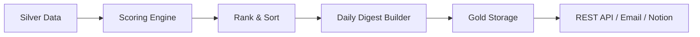

**Outputs:**
| Dataset | Description | Consumer |
|---------|-------------|----------|
| Scored Tasks | Tasks with deterministic priority scores | API `/tasks/scored`, CLI |
| Daily Digest | Top-N tasks + calendar context + insights | API `/digests/daily`, Email |

### Pipeline Scheduler (`src/brain/pipeline/scheduler.py`)

Orchestrates the full Bronze → Silver → Gold DAG.

```python
# Single execution
scheduler = PipelineScheduler(bronze, silver, gold)
result = scheduler.execute(tenant_id="t_abc123")
# Returns: PipelineRun with per-stage timing and status
```

---

## Multi-Tenant Architecture

### Tenant Isolation Model

```mermaid
graph TB
    subgraph "Tenant A (Free)"
        A_S[Storage: data/tenants/a/]
        A_K[Encryption Key: PBKDF2(master, 'a')]
        A_Q[Quota: 3 runs/day, 100 tasks]
    end

    subgraph "Tenant B (Premium)"
        B_S[Storage: data/tenants/b/]
        B_K[Encryption Key: PBKDF2(master, 'b')]
        B_Q[Quota: 100 runs/day, 10000 tasks]
    end

    subgraph "Shared Infrastructure"
        API[FastAPI Server]
        Q[Task Queue]
        W[Workers]
    end

    API --> A_S & B_S
    Q --> W
```

**Isolation guarantees:**
- **Storage**: Each tenant gets a separate directory partition
- **Encryption**: Per-tenant derived keys — compromise of one does not expose others
- **Quotas**: Tier-based limits enforced before pipeline execution
- **RBAC**: Permissions checked at every API endpoint

### Tenant Tiers

| Tier | Pipeline Runs/Day | Max Tasks | LLM Calls/Day | Premium LLM | Nested LXC |
|------|-------------------|-----------|---------------|-------------|------------|
| Free | 3 | 100 | 5 | No | No |
| Standard | 20 | 1,000 | 50 | No | No |
| Premium | 100 | 10,000 | 200 | Yes (Ollama — qwen2:1.5b) | Yes |

---

## n8n Per-Tenant Orchestration

Each tenant customises their VelaFlow pipeline through n8n’s visual workflow editor.
n8n acts as the orchestration layer between the tenant and the VelaFlow API:

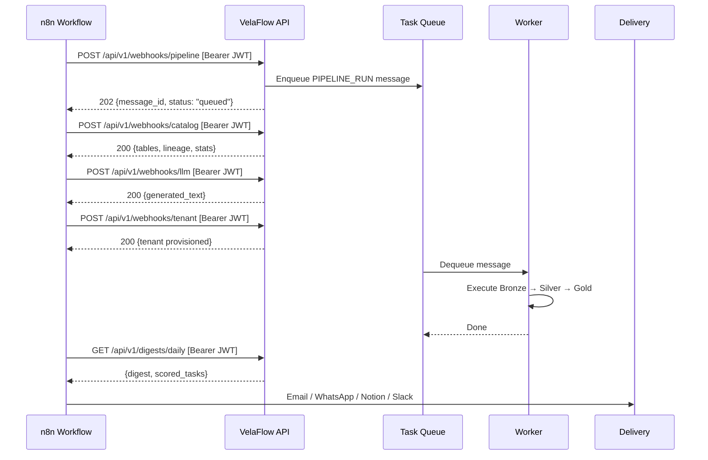

**Per-tenant customisation (no coding required):**
- Schedule: change Cron trigger in n8n
- Data sources: toggle which APIs are included
- Delivery channels: add/remove Email, WhatsApp, Notion, Slack nodes
- Filters: n8n IF/Switch nodes route tasks by priority or label
- LLM polish: premium tenants route through local Ollama

**n8n webhook endpoints (5 total):**

| Endpoint | Purpose | Mode |
|----------|---------|------|
| `POST /webhooks/pipeline` | Trigger full Bronze→Silver→Gold pipeline | Async (queued) |
| `POST /webhooks/digest` | Generate daily digest | Async (queued) |
| `POST /webhooks/catalog` | Query catalog metadata (tables, lineage, stats) | Synchronous |
| `POST /webhooks/llm` | Trigger LLM text generation | Synchronous |
| `POST /webhooks/tenant` | Tenant provisioning and config management | Synchronous |

---

## Premium Tier — Local LLM

Premium tenants get a dedicated Ollama instance for privacy-first inference.
GPU is used automatically if available; otherwise CPU-only mode is used.

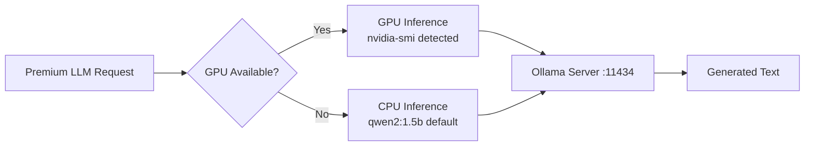

| Feature | Detail |
|---------|--------|
| Default model | qwen2:1.5b (934 MB — fits 4 GB allocation) |
| GPU detection | Automatic via `nvidia-smi` at startup |
| Scaling | KEDA scales premium pods 0→3 based on LLM queue depth |
| Upgrade path | Change `PREMIUM_LLM_MODEL` env var: phi3:3.8b → llama3.2:3b → larger |

---

## Security Architecture

### Authentication Flow

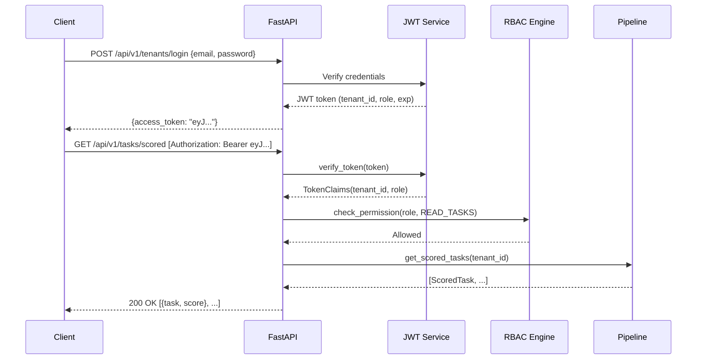

### RBAC Permission Matrix

| Permission | Free | Standard | Premium | Admin |
|-----------|------|----------|---------|-------|
| `READ_BRONZE` | Yes | Yes | Yes | Yes |
| `READ_SILVER` | Yes | Yes | Yes | Yes |
| `READ_GOLD` | Yes | Yes | Yes | Yes |
| `WRITE_BRONZE` | Yes | Yes | Yes | Yes |
| `VIEW_TENANT` | Yes | Yes | Yes | Yes |
| `RUN_PIPELINE` | Yes | Yes | Yes | Yes |
| `VIEW_PIPELINE_RUNS` | Yes | Yes | Yes | Yes |
| `GENERATE_DIGEST` | Yes | Yes | Yes | Yes |
| `MANAGE_TENANT` | No | Yes | Yes | Yes |
| `USE_LLM` | No | Yes | Yes | Yes |
| `USE_PREMIUM_LLM` | No | No | Yes | Yes |
| `ADMIN_ALL` | No | No | No | Yes |

### PII Detection Patterns

| Pattern | Regex | Example |
|---------|-------|---------|
| Credit Card | `\b\d{4}[\s-]?\d{4}[\s-]?\d{4}[\s-]?\d{4}\b` | `4111-1111-1111-1111` |
| Email | `\b[A-Za-z0-9._%+-]+@[A-Za-z0-9.-]+\.[A-Z]{2,}\b` | `user@example.com` |
| International Phone | `\b\+\d{1,3}[\s.-]?\d{3,14}\b` | `+351 912 345 678` |
| US SSN | `\b\d{3}-\d{2}-\d{4}\b` | `123-45-6789` |
| IBAN | `\b[A-Z]{2}\d{2}[A-Z0-9]{4,30}\b` | `PT50000201231234567890154` |
| Portuguese NIF | `\b\d{9}\b` (context-aware) | `123456789` |

### Field-Level Encryption

```
Plaintext → PBKDF2(master_key, tenant_id, 100k iterations) → tenant_key
tenant_key + random_nonce → AES-256-GCM → ciphertext (with authentication tag)
Stored: nonce + ciphertext (GCM tag embedded)
```

### Zero-Trust Inter-Component Security (`security/zero_trust.py`)

All inter-component communication is signed and verified:

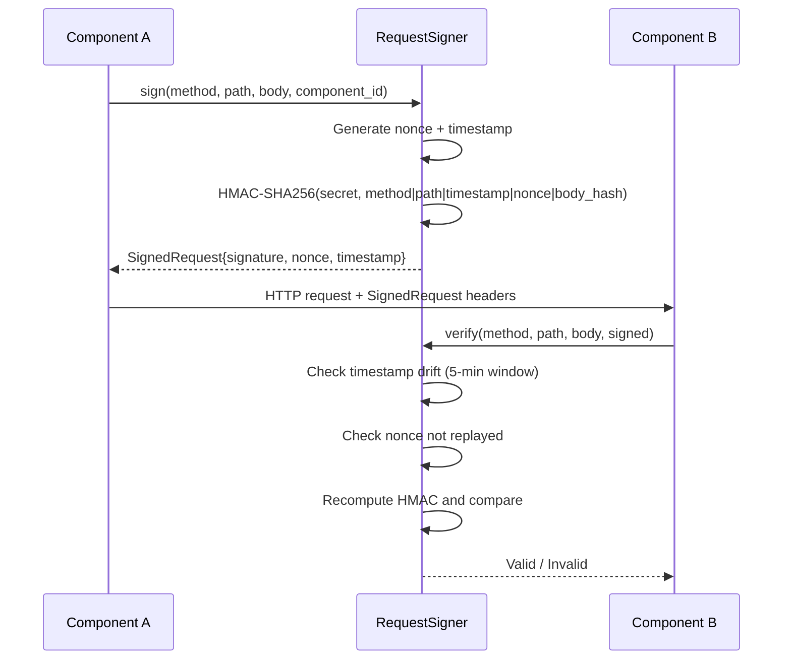

**Defense layers:**
| Attack | Defense |
|--------|---------|
| Replay attack | Nonce tracking — each nonce used exactly once |
| Timestamp drift | 5-minute window — rejects stale requests |
| Body tampering | HMAC covers method + path + timestamp + nonce + body hash |
| Secret extraction | `VELAFLOW_COMPONENT_SECRET` env var, ephemeral fallback |

**Input sanitization** (`InputSanitizer`):
| Boundary | Validation |
|----------|-----------|
| Tenant ID | Safe chars only `[a-zA-Z0-9_-]`, max 64 chars |
| Content | Max 10,000 chars |
| Identifiers | Alphanumeric + underscore, max 128 chars |
| Labels | Max 50 labels, each validated as identifier |
| Dangerous patterns | SQL injection, XSS, path traversal detection |

**Audit logging** (`AuditLogger`):
- `AUTH_SUCCESS` / `AUTH_FAILURE` — authentication events
- `PERMISSION_DENIED` — RBAC violations
- `DATA_ACCESS` — data layer reads/writes with record counts
- `PIPELINE_EVENT` — stage completion with record counts
- `SECURITY_EVENT` — anomalous patterns (path traversal, injection attempts)

---

## Deployment Architecture

### LXC (Single-Node)

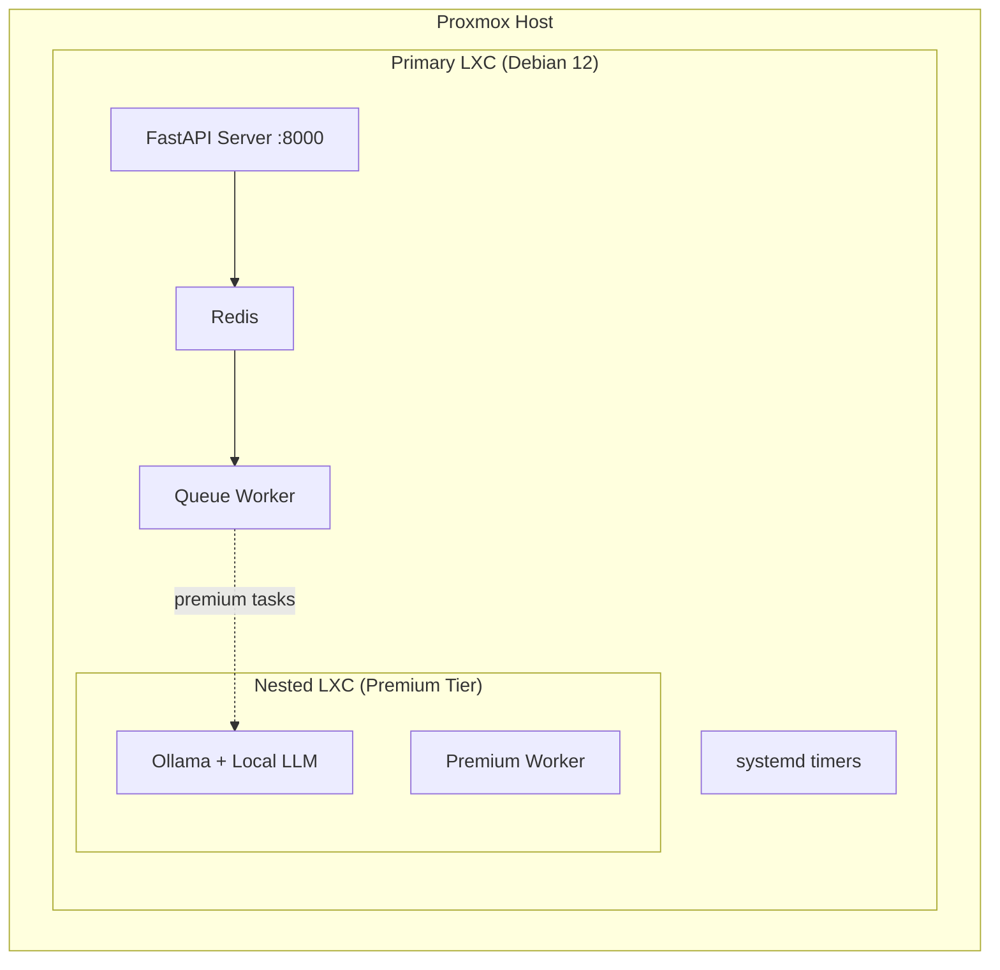

### Kubernetes with KEDA

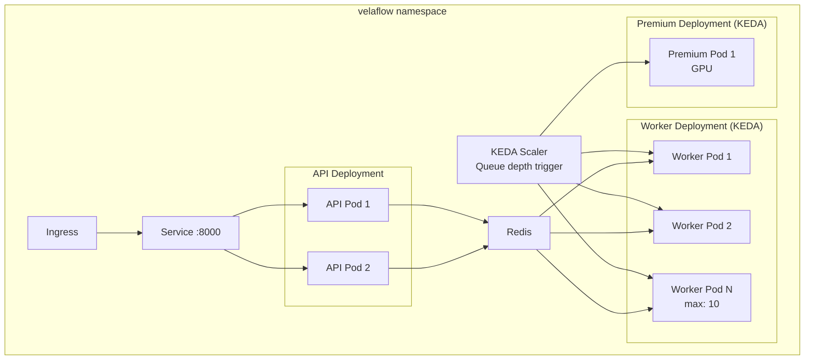

### On-Prem Analytical Engine — DuckDB

The medallion pipeline runs entirely on-prem via DuckDB. VelaFlow deliberately
chose a self-hosted stack over a managed lakehouse (Databricks / Snowflake /
BigQuery) for data sovereignty, zero idle cost on Oracle Always-Free, and a
lightweight in-process runtime (no JVM, no cluster spin-up).

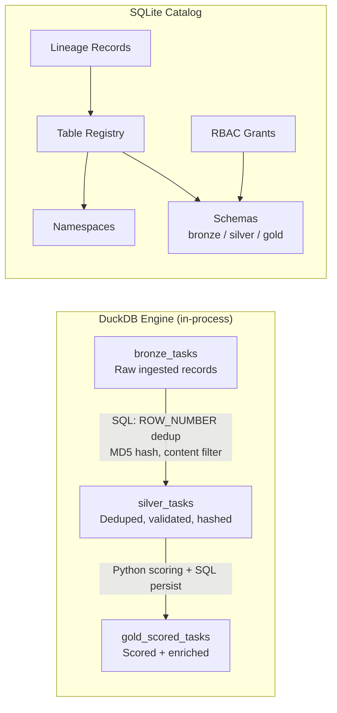

| Component | Purpose | Config |
|-----------|---------|--------|
| `engine/connection.py` | DuckDB connection factory, memory-safe, parameterised queries | `DUCKDB_MEMORY_LIMIT` (default 512 MB) |
| `engine/processor.py` | SQL-based medallion transforms (Bronze→Silver→Gold) | Tables auto-registered in catalog |
| `catalog/store.py` | SQLite-backed catalog with RBAC grants and lineage | `VELAFLOW_CATALOG_DB` path |
| `catalog/models.py` | Domain models: Namespace, Schema, Table, Grant, Lineage | Enum-based grant levels |
| `config/pipeline.yaml` | Declarative pipeline config (stages, grants, engine, environments) | Stages, grants, engine, environments |

---

## Module Dependency Graph

```mermaid
graph TB
    subgraph "Original Modules (unchanged)"
        CLI[cli.py]
        CFG[config.py]
        MOD[models.py]
        PLN[planner.py]
        TOD[todoist.py]
        NOT[notion.py]
        LLM[llm.py]
    end

    subgraph "Enterprise Modules (new)"
        B[pipeline/bronze.py]
        S[pipeline/silver.py]
        G[pipeline/gold.py]
        SCH[pipeline/scheduler.py]
        APP[api/app.py]
        AUTH[api/auth.py]
        MID[api/middleware.py]
        WHK[api/routes/webhooks.py]
        PII[security/pii.py]
        ENC[security/encryption.py]
        ZT[security/zero_trust.py]
        DUCK[engine/connection.py]
        MPROC[engine/processor.py]
        CMOD[catalog/models.py]
        CSTR[catalog/store.py]
        RBAC_M[security/rbac.py]
        TEN[tenant/manager.py]
        TMOD[tenant/models.py]
        STR[storage/local.py]
        QUE[queue/tasks.py]
        WRK[queue/worker.py]
        LLM_L[llm_local.py]
    end

    %% Enterprise depends on original
    G --> PLN
    G --> MOD
    S --> PII
    B --> STR
    S --> STR
    G --> STR
    TEN --> STR
    TEN --> ENC
    TEN --> TMOD
    SCH --> B & S & G
    APP --> AUTH & MID & RBAC_M
    APP --> WHK
    WHK --> QUE
    WRK --> QUE
    LLM_L -.->|premium tier| LLM

    %% Original internal deps (unchanged)
    CLI --> CFG & PLN & TOD & NOT & LLM
    PLN --> MOD
```

---

## Test Coverage Summary

| Module | Tests | Key Assertions |
|--------|-------|---------------|
| Storage | 11 | CRUD, path traversal prevention, overwrite, nested paths |
| PII Detection | 15 | All 6 pattern categories, custom patterns, multi-match masking |
| Encryption + RBAC | 22 | Roundtrip, tenant isolation, key tampering, all 4 roles |
| Bronze Pipeline | 7 | Per-source ingestion, tenant isolation, batch listing |
| Silver Pipeline | 13 | Schema validation, dedup, PII masking, persistence |
| Gold Pipeline | 8 | Scoring accuracy, digest production, persistence |
| Pipeline Scheduler | 7 | Full DAG orchestration, multi-source, error propagation |
| Tenant Management | 17 | CRUD lifecycle, tier changes, token encryption, partition isolation |
| JWT Auth | 6 | Create/verify tokens, expiry, tampering, missing claims |
| Queue/Worker | 10 | FIFO ordering, retry logic, dead letter, handler dispatch |
| Webhooks | 6 | Models, queue integration for n8n |
| Local LLM | 13 | GPU detection, hardware profile, Ollama client |
| **Total** | **159** | **All passing** |

---

## Data Flow: End-to-End Request

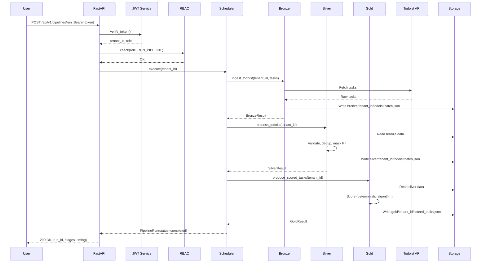
