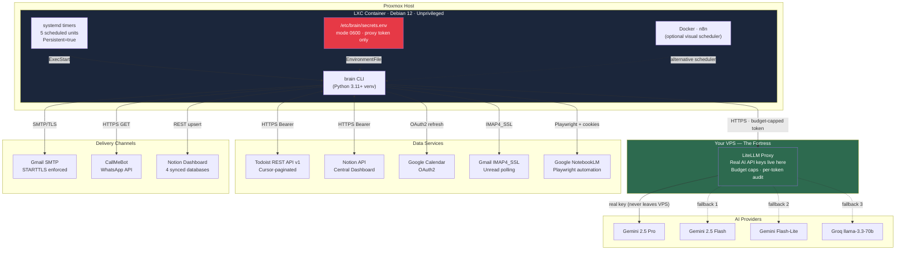
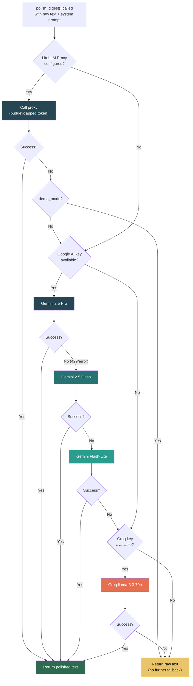
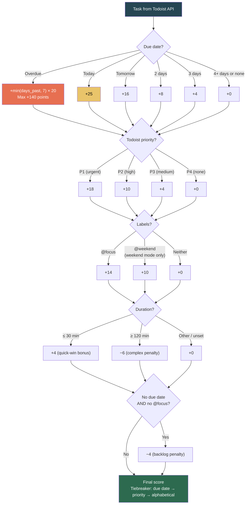
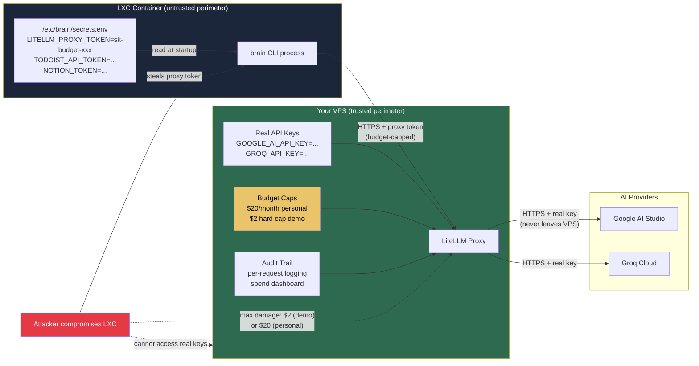
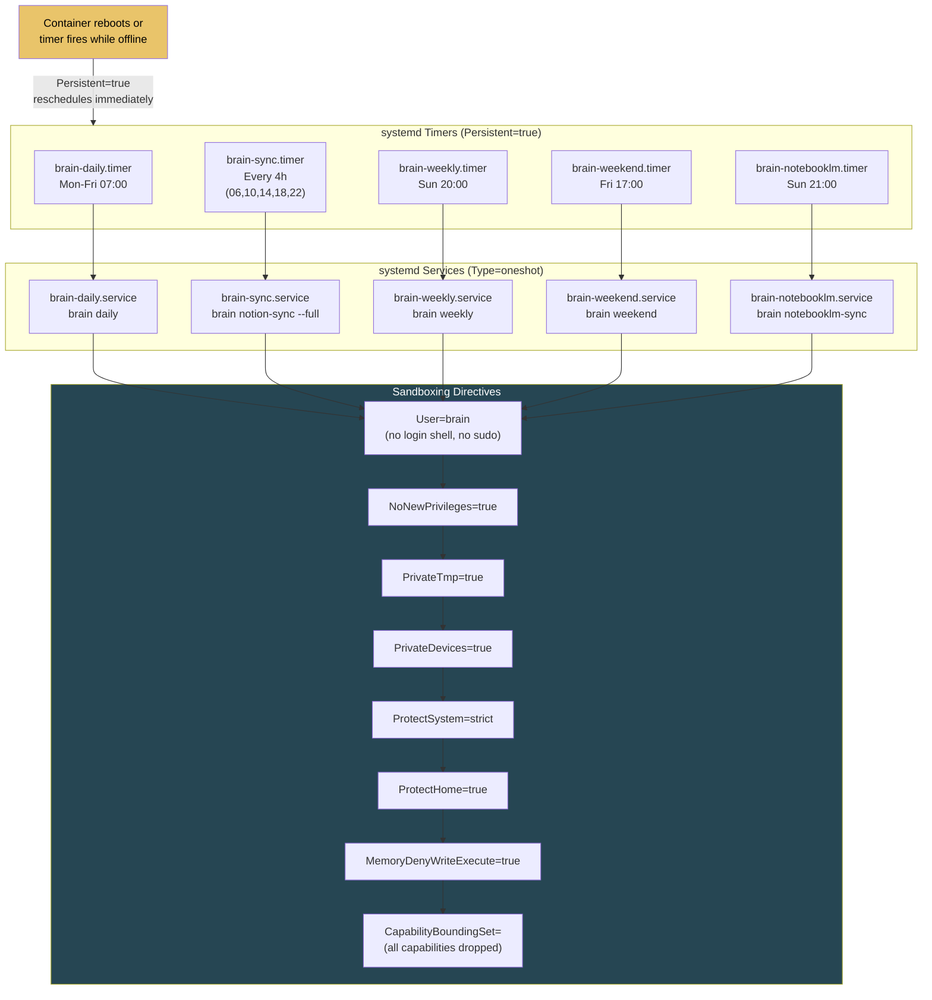
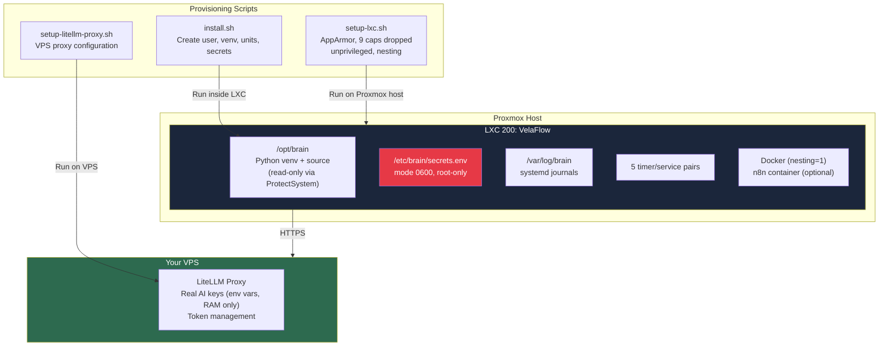
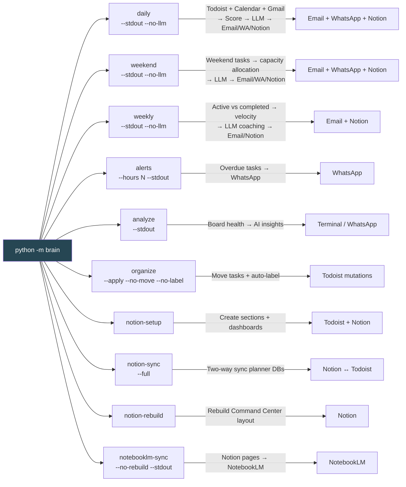

# VelaFlow — System Architecture (Visual Reference)

> Use this document with NotebookLM to generate technical deep-dive questions and build a
> learning path. Every diagram below is self-contained and explains one dimension
> of the system.

---

## 1. High-Level System Architecture

This is the "big picture." It shows every external service, how VelaFlow connects
to them, and where secrets live.

### How to explain this technically

> "VelaFlow runs inside an unprivileged Proxmox LXC container. Five systemd
> timers trigger a Python CLI that pulls data from Todoist, Google Calendar, and
> Gmail, scores tasks deterministically, polishes the output with an LLM, and
> delivers the result via email, WhatsApp, and Notion. The key security decision
> is the Zero-Trust Proxy: real AI API keys never enter the container — only a
> budget-capped proxy token lives there. If the container is compromised, the
> attacker can spend at most a few dollars before the token self-destructs."

---

## 2. Data Flow — Daily Briefing (end-to-end)

This is the most important flow to understand in technical reviews. It exercises every
major component.

```mermaid
sequenceDiagram
    autonumber
    participant Timer as systemd timer<br/>Mon-Fri 07:00
    participant CLI as brain CLI
    participant Todoist as Todoist API v1
    participant GCal as Google Calendar
    participant Gmail as Gmail IMAP
    participant Scorer as planner.py<br/>Scoring Engine
    participant LLM as llm.py<br/>Fallback Chain
    participant Proxy as LiteLLM Proxy<br/>(VPS)
    participant SMTP as Gmail SMTP
    participant WA as CallMeBot
    participant Notion as Notion API

    Timer->>CLI: ExecStart: brain daily

    rect rgb(40, 60, 90)
        Note over CLI,Gmail: PARALLEL DATA INGESTION
        CLI->>Todoist: GET /tasks (cursor-paginated)
        Todoist-->>CLI: Task[] (today + upcoming 7d)
        CLI->>GCal: GET /calendar/v3/events
        GCal-->>CLI: CalendarEvent[]
        CLI->>Gmail: IMAP SEARCH UNSEEN (last 24h)
        Gmail-->>CLI: EmailAlert[]
    end

    rect rgb(60, 40, 20)
        Note over CLI,Scorer: DETERMINISTIC SCORING
        CLI->>Scorer: score_task() for each task
        Note over Scorer: Overdue +20/day (cap 7d)<br/>Due today +25<br/>Priority P1 +18<br/>@focus +14<br/>Quick-win +4<br/>No date & no focus −4
        Scorer-->>CLI: ScoredTask[] sorted by score
        CLI->>Scorer: build_daily_digest(scored, events, emails)
        Scorer-->>CLI: DigestResult (subject + body)
    end

    rect rgb(30, 70, 50)
        Note over CLI,Proxy: LLM POLISH (Zero-Trust)
        CLI->>LLM: polish_digest(raw_text, prompt)
        LLM->>Proxy: POST /chat/completions (proxy token)
        Note over Proxy: Routes to Gemini Pro (real key on VPS)
        Proxy-->>LLM: Polished text
        Note over LLM: If proxy fails → Gemini Flash → Flash-Lite → Groq → raw text
        LLM-->>CLI: Final polished briefing
    end

    rect rgb(70, 40, 60)
        Note over CLI,Notion: PARALLEL DELIVERY
        CLI->>SMTP: Send HTML digest email (STARTTLS)
        CLI->>WA: Send WhatsApp summary (HTTPS GET)
        CLI->>Notion: Upsert to Daily Planner DB
    end
```

### How to explain this technically

> "The daily briefing follows a pipeline pattern: ingest, score, polish, deliver.
> First, we fetch tasks, calendar events, and emails in parallel. Then the
> scoring engine — which is pure Python, no ML — ranks every task using a
> deterministic point system: overdue days, priority level, labels, and duration.
> The ranked output is sent to an LLM for natural-language polish via a
> multi-model fallback chain. If all LLMs fail, the raw scored digest is still
> delivered. Finally, the result is pushed to email, WhatsApp, and Notion
> simultaneously."

---

## 3. Multi-Model LLM Fallback Chain

### How to explain this technically

> "The fallback chain is a resilience pattern. The primary path goes through our
> self-hosted LiteLLM proxy, which holds the real API keys. If the proxy is down,
> we try Google AI models in descending quality: Pro, Flash, Flash-Lite. Each
> step is cheaper and faster, so we gracefully degrade through rate limits and
> quota exhaustion. If all Google models fail, we try Groq as an external
> fallback. If everything fails, we still deliver the raw deterministic digest —
> the system never silently drops a scheduled briefing."

---

## 4. Task Scoring Algorithm

### How to explain this technically

> "The scoring algorithm is parameter-free and deterministic — no machine
> learning, no configuration needed. Each task accumulates points from five
> independent factors: urgency (overdue compounds at 20 points per day, capped
> at 7 days), deadline proximity, user-set priority, label signals like @focus,
> and duration bonuses for quick wins. The design principle is that even without
> any AI, the system produces a usable priority ranking. AI only polishes the
> presentation."

---

## 5. Zero-Trust Proxy Security Model

### How to explain this technically

> "The core security insight is that secrets vaults don't solve the real problem.
> If a real API key enters a container's memory — even transiently via a vault
> fetch — it can be extracted via /proc, memory dump, or network interception.
> Instead, I keep real keys exclusively on a VPS I control, running a LiteLLM
> reverse proxy. The container gets only a budget-capped proxy token. If the
> token is stolen, the attacker can spend a few dollars before the budget
> self-destructs. Revocation is one curl call — no container redeployment
> needed."

---

## 6. Notion Two-Way Sync

```mermaid
sequenceDiagram
    autonumber
    participant Timer as brain-sync.timer<br/>Every 4h
    participant CLI as brain notion-sync
    participant Todoist as Todoist API
    participant Notion as Notion API

    Timer->>CLI: ExecStart

    rect rgb(40, 60, 90)
        Note over CLI,Notion: TODOIST → NOTION (forward sync)
        CLI->>Todoist: GET tasks in planner sections<br/>(Daily, Weekly, Weekend)
        Todoist-->>CLI: Task[]
        loop For each planner section
            CLI->>Notion: Query DB for existing pages
            Notion-->>CLI: Page[] with todoist_id property
            alt Task exists in Notion
                CLI->>Notion: PATCH page (update properties)
            else Task is new
                CLI->>Notion: POST page (create)
            end
        end
    end

    rect rgb(60, 40, 50)
        Note over CLI,Todoist: NOTION → TODOIST (reverse sync)
        CLI->>Notion: Query for Notion-only tasks<br/>(no todoist_id, not synced)
        Notion-->>CLI: Page[] created in Notion UI
        loop For each Notion-only task
            CLI->>Todoist: POST /tasks (create in correct section)
            Todoist-->>CLI: new Task with id
            CLI->>Notion: PATCH page (store todoist_id)
        end
    end

    Note over CLI: Log: X created, Y updated, Z errors
```

### How to explain this technically

> "The sync is idempotent and conflict-aware. Forward sync reads Todoist planner
> sections and upserts into Notion databases — existing pages are updated, new
> tasks are created. Reverse sync detects tasks created directly in Notion (they
> have no todoist_id) and pushes them back to Todoist, then stores the returned
> ID in Notion so the next sync recognises them. There's no local database — all
> state lives in Todoist and Notion, making the system stateless and safe to
> re-run."

---

## 7. systemd Scheduling and Hardening

### How to explain this technically

> "I chose systemd timers over cron for three reasons: structured logging via
> journalctl, dependency ordering between units, and kernel-level sandboxing.
> Every service unit runs as a dedicated brain user with zero capabilities,
> private /tmp, read-only filesystem, and memory write-execute prevention. The
> Persistent=true flag ensures that if the container is offline when a timer
> fires, the job runs immediately on next boot."

---

## 8. Deployment Topology

---

## 9. CLI Command Map

---

## 10. Failure Modes and Resilience

```mermaid
flowchart TD
    subgraph FAILURES["Possible Failures"]
        F1["LLM proxy down"]
        F2["Gemini rate-limited (429)"]
        F3["All AI providers fail"]
        F4["Todoist API down"]
        F5["Gmail IMAP error"]
        F6["WhatsApp/CallMeBot fails"]
        F7["Notion API error"]
        F8["NotebookLM cookies expired"]
        F9["Container offline during timer"]
    end

    subgraph RECOVERIES["Recovery Actions"]
        R1["Try Gemini Flash → Flash-Lite → Groq → raw text"]
        R2["Try next model in chain"]
        R3["Deliver raw deterministic digest (no AI)"]
        R4["Exit non-zero → systemd logs → retry next timer fire"]
        R5["Skip email section → digest still delivers"]
        R6["Email still sends independently"]
        R7["Log error → retry on next notion-sync run"]
        R8["Re-authenticate via VNC or push script"]
        R9["Persistent=true → reschedule on next boot"]
    end

    F1 --> R1
    F2 --> R2
    F3 --> R3
    F4 --> R4
    F5 --> R5
    F6 --> R6
    F7 --> R7
    F8 --> R8
    F9 --> R9

    style FAILURES fill:#e63946,color:#fff
    style RECOVERIES fill:#2d6a4f,color:#fff
```

