# Architecture — VelaFlow

> Technical reference for the self-hosted AI productivity automation system.

---

## R17.2 Security Perimeter (zero-trust inside the LXC)

VelaFlow's threat model assumes an attacker may already hold shell access
inside the LXC. Every filesystem-touching code path is therefore layered
with a Snyk-verified zero-finding sanitization chain:

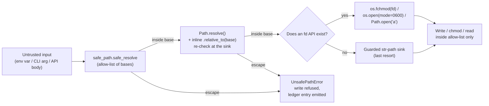

- `src/brain/security/safe_path.py` — allow-list resolver (`safe_resolve`,
  `default_bases`, `UnsafePathError`).
- Every sink (`action_ledger._append`, `secure_logging._HMACRotatingHandler`,
  `secure_logging._derive_key`, `scripts/drive_backup.py::run_restore`,
  `scripts/chat_to_markdown.py`, `scripts/preflight.py::_check_data_dir`)
  repeats the `relative_to(base)` guard locally so Snyk sees a per-function
  sanitizer and does not depend on cross-module dataflow.
- `os.fchmod` on an already-open fd replaces `os.chmod` on a path string.
  `os.open(..., mode=0o600)` sets the HMAC-key file mode at creation rather
  than via a separate chmod. `Path.open` replaces the builtin `open()` in
  the action-ledger append sink.
- Tar restore uses `tar.extractfile()` + `shutil.copyfileobj(..., length=64*1024)`
  into a path whose `.resolve().relative_to(target)` is checked inline for
  every member. `tar.extract(path=)` is not used.

Result: `snyk code test --severity-threshold=medium` reports **0 findings**
with **0 `.snyk` ignores**. See [SECURITY-AUDIT.md § Round 17.2](SECURITY-AUDIT.md).

---

## High-Level System Architecture

```mermaid
graph TB
    subgraph Internet["External Services"]
        TODOIST["Todoist API v1<br/>(cursor-paginated)"]
        NOTION["Notion API<br/>Central Dashboard<br/>Two-way Sync"]
        GCAL["Google Calendar<br/>OAuth2 API"]
        GMAIL_IMAP["Gmail IMAP<br/>Unread alerts"]
        GEMINI_PRO["Gemini 2.5 Pro<br/>(on proxy VPS)"]        
        GEMINI_FLASH["Gemini 2.5 Flash<br/>(on proxy VPS)"]
        GEMINI_LITE["Gemini 2.5 Flash-Lite<br/>(on proxy VPS)"]
        GROQ["Groq API<br/>llama-3.3-70b (on proxy VPS)"]
        LITELLM["LiteLLM Proxy<br/>Your VPS — real keys here"]
        CALLMEBOT["CallMeBot<br/>WhatsApp API"]
        GMAIL_SMTP["Gmail SMTP<br/>App Password"]
        NLM["NotebookLM<br/>(free consumer tier)<br/>unofficial API"]
    end

    subgraph LXC["Proxmox LXC (Debian 12)"]
        subgraph SYSTEMD["systemd timers"]
            T_DAILY["brain-daily.timer<br/>Mon-Fri 07:00"]
            T_SYNC["brain-sync.timer<br/>Every 4h"]
            T_WEEKLY["brain-weekly.timer<br/>Sun 20:00"]
            T_WEEKEND["brain-weekend.timer<br/>Fri 17:00"]
            T_NLM["brain-notebooklm.timer<br/>Sun 21:00"]
        end

        subgraph PYTHON["Python 3.11+ (venv at /opt/brain)"]
            CLI["cli.py — CLI entry point"]
            CONFIG["config.py<br/>Settings from environment"]
            TODOIST_MOD["todoist.py<br/>API v1 Client (delete-protected)"]
            NOTION_MOD["notion.py<br/>Dashboard Builder + Two-way Sync"]
            ORGANIZER["organizer.py<br/>Board Intelligence — Analyse + Reorganise"]
            CAL_MOD["calendar_ctx.py<br/>Events Fetcher"]
            GMAIL_MOD["gmail_alerts.py<br/>IMAP Reader"]
            PLANNER["planner.py<br/>Scoring Engine"]
            LLM_MOD["llm.py<br/>Gemini Fallback Chain"]
            EMAIL_MOD["email_sender.py<br/>SMTP Sender"]
            WA_MOD["whatsapp.py<br/>CallMeBot Client"]
            NLM_MOD["notebooklm.py<br/>Notion \u2192 NotebookLM Sync"]
        end

        DOCKER["Docker (optional)<br/>n8n alternative scheduler"]
    end

    subgraph NOTION_PAGES["Notion Dashboard"]
        CMD_CTR["Command Center"]
        DAILY_PAGE["Daily Planner + Tasks DB"]
        WEEKLY_PAGE["Weekly Planner + Tasks DB"]
        WEEKEND_PAGE["Weekend Planner + Tasks DB"]
        BOARD_PAGE["Task Board + All Tasks DB"]
    end

    subgraph TODOIST_BOARD["Todoist Kanban Board"]
        direction TB
        S_REJECTED["Rejected"]
        S_BACKLOG["Backlog"]
        S_LOW["To Do - Low"]
        S_NORMAL["To Do - Normal"]
        S_HIGH["To Do - High"]
        S_URGENT["To Do - Urgent/Today"]
        S_WEEKEND_P["Weekend Planner (AI)"]
        S_WEEKLY_P["Weekly Planner (AI)"]
        S_DAILY_P["Daily Planner (AI)"]
        S_DOING["Doing"]
        S_RECURRING["Ongoing recurring"]
        S_BLOCKED["Blocked"]
        S_DONE["Done"]
    end

    subgraph RECIPIENTS["Notification Recipients"]
        INBOX["Email Inbox"]
        PRIMARY_WA["WhatsApp — primary"]
        SECONDARY_WA["WhatsApp — secondary recipient"]
    end

    %% Scheduling
    T_DAILY -->|"ExecStart"| CLI
    T_SYNC -->|"ExecStart"| CLI
    T_WEEKLY -->|"ExecStart"| CLI
    T_WEEKEND -->|"ExecStart"| CLI
    T_NLM -->|"ExecStart"| CLI

    %% Config
    CLI --> CONFIG

    %% CLI internal wiring
    CLI --> TODOIST_MOD
    CLI --> NOTION_MOD
    CLI --> ORGANIZER
    CLI --> CAL_MOD
    CLI --> GMAIL_MOD
    CLI --> PLANNER
    CLI --> LLM_MOD
    CLI --> EMAIL_MOD
    CLI --> WA_MOD
    CLI --> NLM_MOD

    %% External API calls
    TODOIST_MOD <-->|"HTTPS API v1"| TODOIST
    NOTION_MOD <-->|"HTTPS API"| NOTION
    CAL_MOD -->|"OAuth2"| GCAL
    GMAIL_MOD -->|"IMAP4_SSL"| GMAIL_IMAP
    LLM_MOD -->|"Primary (proxy token)"| LITELLM
    LITELLM -->|"real key, server-side"| GEMINI_PRO
    LITELLM -.->|"Fallback 1"| GEMINI_FLASH
    LITELLM -.->|"Fallback 2"| GEMINI_LITE
    LITELLM -.->|"Fallback 3"| GROQ
    LLM_MOD -.->|"Dev fallback (no proxy)"| GEMINI_FLASH
    EMAIL_MOD -->|"SMTP/TLS"| GMAIL_SMTP
    WA_MOD -->|"HTTPS GET"| CALLMEBOT

    %% Notion structure
    NOTION --- CMD_CTR
    NOTION --- DAILY_PAGE
    NOTION --- WEEKLY_PAGE
    NOTION --- WEEKEND_PAGE
    NOTION --- BOARD_PAGE

    %% Two-way sync
    NOTION_MOD <-->|"Two-way sync"| DAILY_PAGE
    NOTION_MOD <-->|"Two-way sync"| WEEKLY_PAGE
    NOTION_MOD <-->|"Two-way sync"| WEEKEND_PAGE
    TODOIST <-->|"Planner sections"| NOTION_MOD

    %% Delivery
    GMAIL_SMTP --> INBOX
    CALLMEBOT --> PRIMARY_WA
    CALLMEBOT --> SECONDARY_WA
    NLM_MOD -->|"pasted-text sources<br/>(notebooklm-py)"| NLM
    NOTION_MOD -->|"read all pages"| NLM_MOD
```

---

## Workflow Schedule and Routing

```mermaid
graph LR
    subgraph SCHEDULES["systemd Timers"]
        S1["Mon-Fri 07:00<br/>Daily Briefing"]
        S2["Every 4h 08-22<br/>Notion Sync"]
        S3["Friday 17:00<br/>Weekend Planner"]
        S4["Sunday 20:00<br/>Weekly Review"]
        S5["Sunday 21:00<br/>NotebookLM Sync"]
    end

    subgraph CLI_CMDS["brain CLI Commands"]
        C1["brain daily"]
        C2["brain notion-sync --full"]
        C3["brain weekend"]
        C4["brain weekly"]
        C5["brain notion-sync"]
        C6["brain analyze"]
        C7["brain organize"]
        C8["brain alerts"]
        C9["brain notebooklm-sync"]
    end

    subgraph DELIVERY["Delivery Channels"]
        EMAIL["Email (SMTP)"]
        WA_P["WhatsApp primary"]
        WA_S["WhatsApp secondary"]
        NOTION_OUT["Notion Planner DBs"]
        NLM_OUT["NotebookLM notebook"]
    end

    S1 --> C1
    S2 --> C2
    S3 --> C3
    S4 --> C4
    S5 --> C9

    C1 --> EMAIL
    C1 --> WA_P
    C1 --> NOTION_OUT
    C8 --> WA_P
    C3 --> EMAIL
    C3 --> WA_P
    C3 --> WA_S
    C3 --> NOTION_OUT
    C4 --> EMAIL
    C4 --> NOTION_OUT
    C5 --> NOTION_OUT    C9 --> NLM_OUT    C2 --> NOTION_OUT
```

---

## Task Scoring Algorithm

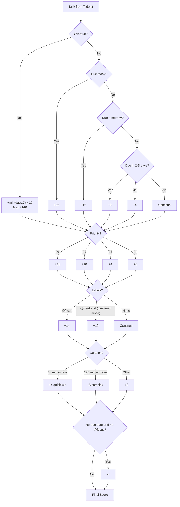

---

## Data Flow — Daily Briefing

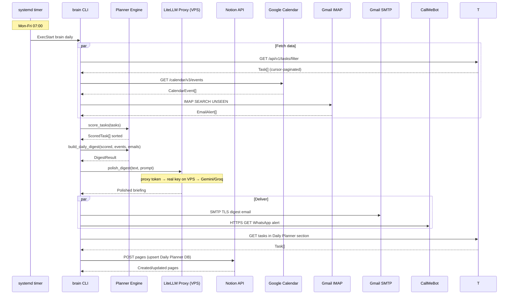

---

## Notion Dashboard Structure

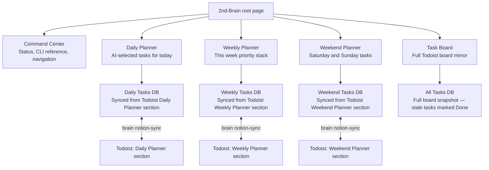

---

## Todoist Kanban Board Sections

```
Rejected              <- Discarded tasks
Backlog               <- Future tasks (no date)
To Do - Low           <- P4 tasks with dates
To Do - Normal        <- P3 tasks
To Do - High          <- P2 tasks
To Do - Urgent/Today  <- P1 + overdue + due today
─────────────── AI PLANNER SECTIONS ──────────────
Weekend Planner       <- AI-selected for weekend   (brain weekend)
Weekly Planner        <- AI-selected for this week (brain weekly)
Daily Planner         <- AI-selected for today     (brain daily)
───────────────────────────────────────────────────
Doing                 <- Currently in progress
Ongoing recurring     <- Recurring tasks
Blocked               <- Blocked (deprioritised by AI, -20 penalty)
Done                  <- Completed (marked automatically by sync)
```

---

## Security Architecture

> **Round 16 update (2026-04-30):** Per-tenant BYO Gemini API keys are now
> encrypted at rest with `FieldEncryptor` (AES-256-GCM + per-tenant PBKDF2-derived
> keys), stored in `TenantConfig.gemini_api_key_encrypted`, decrypted only
> inside a request-scoped `Settings` instance in
> `Worker._build_tenant_settings()`, and wiped by `deactivate_tenant()`. The
> platform owner cannot read a tenant's Gemini key plaintext from storage,
> logs, or memory dumps of the main process.

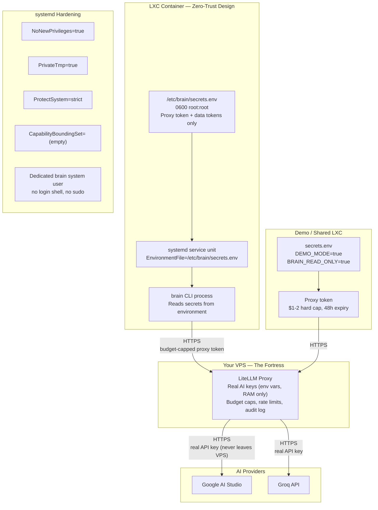

---

## Module Dependency Graph

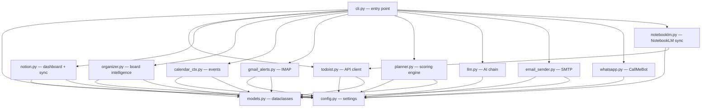

---

## Failure Modes and Fallbacks

| Failure | Recovery |
|---------|---------|
| Gemini Pro rate-limited (429) | Auto-retry with Gemini Flash |
| All Gemini models fail | Try Groq llama-3.3-70b; if that fails, output raw deterministic digest |
| LiteLLM proxy unreachable | Service exits non-zero; systemd logs error; retries on next timer fire |
| Proxy token expired / budget exceeded | Revoke + reissue on VPS; update `LITELLM_PROXY_TOKEN` in secrets.env |
| Todoist API down | CLI exits non-zero; systemd logs error; retries on next timer fire |
| Gmail IMAP error | Skip email section; digest still delivers without email context |
| WhatsApp (CallMeBot) fails | Email still sends independently |
| Notion API error | Sync logged; retried on next `brain notion-sync` run |
| NotebookLM cookie expired | Sync fails; re-authenticate via VNC or push script (see deployment.md Step 6) |

---

## Resilience Patterns (v2.0)

All enterprise components use resilience patterns from `brain.security.resilience`:

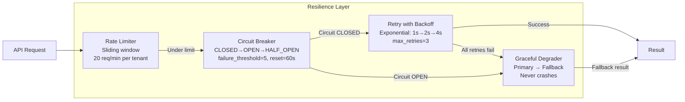

| Pattern | Implementation | Configuration |
|---------|---------------|---------------|
| **Circuit Breaker** | `CircuitBreaker(failure_threshold=5, reset_timeout=60)` | Per-service instance, thread-safe |
| **Retry** | `@retry_with_backoff(max_retries=3, base_delay=1.0)` | Exponential backoff, configurable exception filter |
| **Rate Limiter** | `RateLimiter(max_requests=20, window_seconds=60)` | Per-tenant key, sliding window, `WEBHOOK_RATE_LIMIT` env var |
| **Graceful Degrader** | `GracefulDegrader(primary_fn, fallback_fn)` | Logs degradation, always returns a result |

### Secure Structured Logging

All application and security events are processed through `brain.security.secure_logging`:

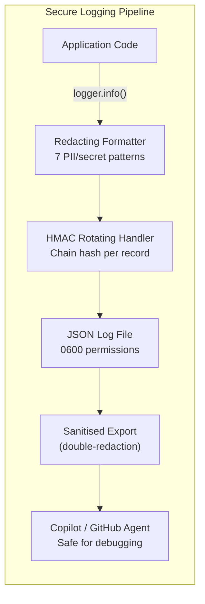

| Component | Implementation | Details |
|-----------|---------------|---------|
| **Redacting Formatter** | `_RedactingFormatter` | Strips API tokens, emails, phones, IPs, SSNs, credit cards, JWTs from all log output |
| **HMAC Chain** | `_HMACRotatingHandler` | Each log record includes `[chain:HASH]` — deletion or tampering breaks the chain |
| **HMAC Key** | Derived from `VELAFLOW_MASTER_KEY` or persisted random key | Not guessable from machine identity |
| **Sanitised Export** | `SecureLogger.export_sanitised()` | Double-redacts and produces Markdown safe for Copilot debugging |
| **JSON Format** | Structured output with `ts`, `level`, `logger`, `msg` fields | Machine-parseable for log aggregation |
| **Rotation** | 50 MB max file size, 10 backup files | Configurable via `LOG_MAX_SIZE_MB` |

### Interactive Installer (TUI Wizard)

`scripts/installer.py` provides an OPNsense-style terminal installer:

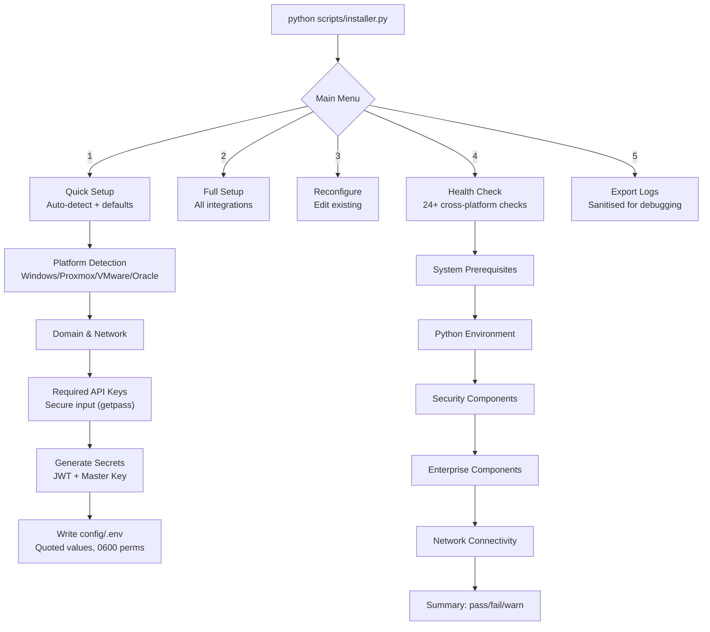

### Webhook Security (10 endpoints)

| Feature | Implementation |
|---------|---------------|
| **Rate Limiting** | Per-tenant sliding window (20 req/min, configurable via `WEBHOOK_RATE_LIMIT`) |
| **Signature Verification** | HMAC-SHA256 (`VELAFLOW_WEBHOOK_SECRET`), optional — enabled when secret is set |
| **Job Tracking** | `GET /webhooks/status/{id}` for async job polling (capped at 1000 entries) |
| **Catalog Singleton** | `@lru_cache` CatalogStore — no connection-per-request overhead |

---

## Multi-Tenant Platform (Round 7-9)

### Tenant Scheduler

The `TenantScheduler` runs as a background thread in the worker process, replacing per-tenant n8n
cron workflows:

- Scans all active tenants every 60 seconds
- Enqueues pipeline runs based on each tenant's `TenantConfig`:
  - **Daily digest**: fires at `daily_digest_time` on configured `daily_digest_days`
  - **Overdue alerts**: fires every `overdue_alert_interval_hours` when enabled
  - **Weekend planner**: Friday 17:00 UTC when enabled
  - **Weekly review**: Sunday 20:00 UTC when enabled
- Deduplication prevents double-enqueue within the same tick

### Billing Integration (Stripe)

- **Checkout**: `POST /billing/checkout` creates a Stripe Checkout Session with redirect URL validation
- **Webhooks**: `POST /webhooks/stripe` handles `checkout.session.completed`, `customer.subscription.deleted`, `invoice.payment_failed`
- Open redirect prevention: all redirect URLs validated against an allow-list
- Stripe SDK is lazy-imported (optional dependency: `pip install velaflow[billing]`)

### Dashboard API

- `GET /dashboard/overview` returns tenant connection status, pipeline config, and usage statistics
- Reads from in-memory `_daily_usage` (protected by `threading.Lock`)

### Per-Tenant Settings

The worker builds a per-request `Settings` object for each tenant, decrypting encrypted tokens
(todoist, notion, gmail, litellm) and falling back to global settings for unconfigured fields.
The global `Settings` object is never mutated (`frozen=True`).

## Enterprise Features (Round 10-12)

### RAG Pipeline (Retrieval-Augmented Generation)

The `brain.rag` module provides a complete RAG pipeline for **VIP** tenants only (plus `demo` and `admin` for evaluation and ops). Premium tenants keep the NotebookLM export workflow instead:

- **DocumentChunker**: Sentence-aware splitting with configurable chunk size (512 tokens) and overlap (64 tokens). Enforces 5MB document size limit.
- **SimpleEmbedder**: Offline hash-based trigram embedding (dimension=128). No API calls required — works without internet access. L2-normalized, position-weighted.
- **VectorStore**: DuckDB-backed vector storage with tenant-scoped isolation. Uses `list_cosine_similarity` for search. Each tenant's vectors are isolated by `tenant_id` column — no cross-tenant leakage.
- **RAGPipeline**: End-to-end pipeline: `ingest()` (chunk → embed → store with quota check), `query()` (embed → search), `augment_prompt()` (query → inject context into system prompt), `delete_document()`, `purge_tenant()`.

Available to **VIP** tier only (enforced via RBAC `USE_RAG` permission; `demo` and `admin` also hold it). Premium is deliberately excluded so the €18/month VIP subscription has a clear differentiator against ChatGPT Plus — see [`adr/0002-local-rag-vs-mosaic-ai.md`](adr/0002-local-rag-vs-mosaic-ai.md).

### Local LLM (Ollama Integration)

- **CPU model**: `qwen2:1.5b` — runs on any Oracle Cloud ARM instance
- **GPU model**: `qwen2:7b` — uses NVIDIA GPU when available
- `LocalLLMClient.chat()`: OpenAI-style messages format via `/api/chat`
- `LocalLLMClient.embed()`: Generates embeddings via Ollama `/api/embeddings`
- K8s KEDA auto-scales GPU pods from 0 when premium LLM requests queue up

### Demo Account System

Six user types: `admin`, `free`, `standard`, `premium`, `vip`, `demo`.

The `DemoManager` (`brain.tenant.demo_manager`) provides time-limited VIP accounts:

- **7-day TTL**: Auto-expires, no renewal without admin action
- **Cost caps**: Configurable pipeline run cap (default 50) and LLM call cap (default 100)
- **Usage analytics**: Every action logged with encrypted audit trail
- **Error forwarding**: Admin notified immediately on demo errors
- **Encrypted audit**: All demo events encrypted with per-tenant derived keys

Admin API routes at `/api/v1/admin/demos`:
- `POST /demos` — Create time-limited VIP demo
- `GET /demos` — List all demo accounts with status
- `GET /demos/{id}/analytics` — Usage analytics for a demo
- `POST /demos/{id}/check-expiry` — Auto-expire if TTL exceeded

### Encrypted Audit Logging

`EncryptedAuditLog` (`brain.security.audit_log`) provides tamper-evident audit trails:

- AES-256-GCM encrypted entries (per-tenant keys via `FieldEncryptor`)
- SHA-256 HMAC chain: each entry hashed with previous entry for tamper detection
- `verify_chain()` detects modification, deletion, or reordering of entries
- Entries rotated monthly (`tenants/{tenant_id}/audit/{YYYY-MM}.log`)
- Attacker with root filesystem access sees only encrypted blobs

### RBAC Enhancements

New permissions: `USE_RAG`, `USE_LOCAL_LLM`.

| Permission | free | standard | premium | vip | demo | admin |
|---|---|---|---|---|---|---|
| USE_RAG | | | | ✓ | ✓ | ✓ |
| USE_LOCAL_LLM | | | ✓ | ✓ | ✓ | ✓ |
| USE_PREMIUM_LLM | | | ✓ | ✓ | ✓ | ✓ |
| MANAGE_TENANT | | | | | | ✓ |

Demo tier has VIP-equivalent features without tenant/user management.

### K8s KEDA Scalers

Three auto-scalers in `deploy/kubernetes/keda-scaler.yaml`:

1. **Worker scaler**: Scales general workers 0→10 based on pipeline queue depth
2. **Premium scaler**: Scales GPU pods 0→3 for local LLM requests (GPU node affinity)
3. **RAG scaler**: Scales RAG workers 0→5 for vector search/ingest requests

---

## Deployment Architecture

### Hardened LXC Deployment Flow

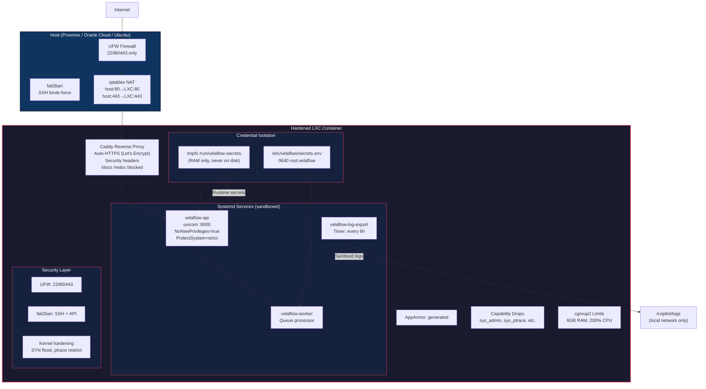

### Oracle Cloud Always-Free Topology

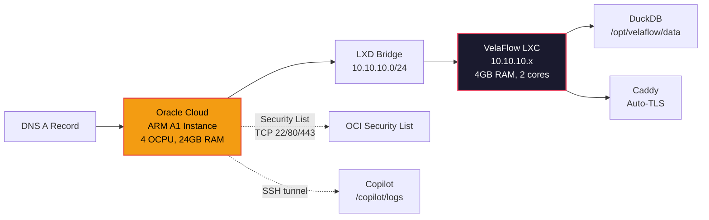

## Autoscaling Architecture (Round 15)

VelaFlow auto-scales from 1 idle user to 1000 concurrent users on Oracle Cloud Always-Free
hardware using Kubernetes HPA (API) and KEDA (queue-driven workers).

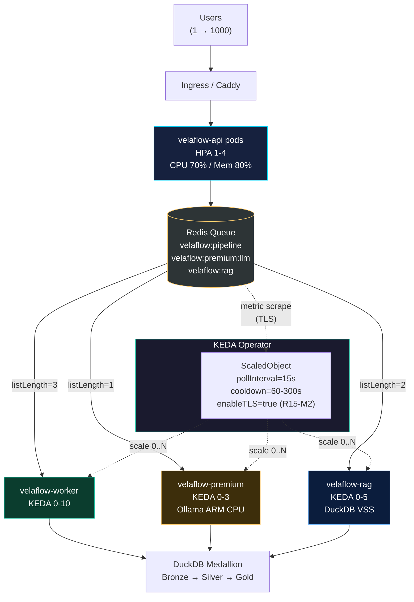

**Load profile** (validated by `tests/test_stress.py`):

| Concurrent users | Queue depth | API pods | Std workers | Premium | RAG |
|------------------|-------------|----------|-------------|---------|-----|
| 1 idle           | 0           | 1        | 0           | 0       | 0   |
| 50 active        | ~5          | 1        | 2           | 0       | 1   |
| 500 burst        | ~100        | 2        | 10 (cap)    | 1       | 3   |
| 1000 burst       | ~1000       | 4 (cap)  | 10 (cap)    | 3 (cap) | 5 (cap) |

At the 1000-user ceiling, the next step is to upgrade the Oracle shape (or add a node). All
scalers honour their `maxReplicaCount` rather than starving the API pods of CPU.

## Action Ledger — Tamper-Evident Crash & Audit Log (Round 15)

Every significant action, API call, pipeline stage, error, and unhandled exception is recorded
to an HMAC-SHA256-chained JSONL log designed for offline-verifiable post-mortem analysis.

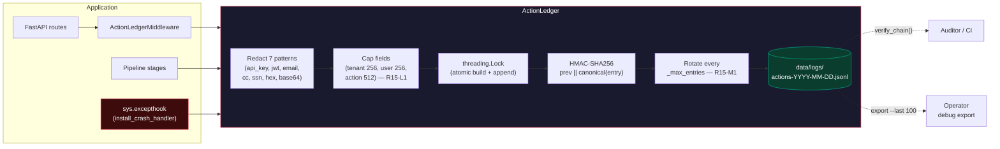

**Integrity guarantee.** Each entry includes `prev = HMAC(KEY, prev_prev || canonical(prev_entry))`.
Flipping any byte in the file is detected by `verify_chain()` which returns the first broken
offset. The HMAC key is read from `VELAFLOW_LOG_HMAC_KEY`; if unset the ledger runs with a
process-local random key **and logs a CRITICAL warning** (R15-H1) — operators must provision a
persistent key for cross-restart tamper detection.

**Field caps (R15-L1).** `tenant_id` and `user_id` are truncated to 256 chars, `action` to 512
chars before serialization. This prevents adversarial log flooding from blowing out disk or
memory.

**Rotation (R15-M1).** A new genesis block is written every `_max_entries` (default 50,000)
entries, bounding any single segment's file size and keeping `verify_chain()` deterministic
per segment.

## Encrypted Off-Site Backups — Google Drive

Six backups per day (4h apart, anchored at 07:30 Europe/Lisbon) are uploaded
to a shared Google Drive folder. Backups are **client-side encrypted with
AES-256-GCM before leaving the host** using `VELAFLOW_BACKUP_KEY` — a key
deliberately kept separate from `VELAFLOW_MASTER_KEY` so that runtime
compromise does not decrypt backups, and vice versa.

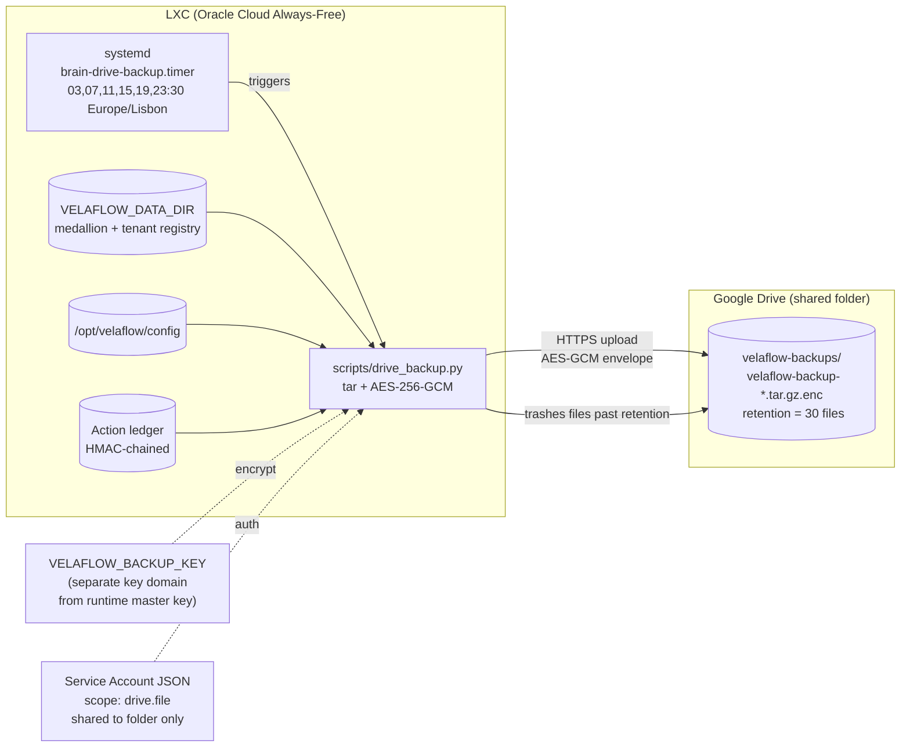

**Envelope format** (`VFBKUP01 | nonce(12) | ciphertext + GCM tag`): magic
bytes are bound as Associated Data so any tampering — header rewrite,
bit-flip, truncation — fails authentication and aborts the restore. Each
upload records the key fingerprint (first 16 hex chars of SHA-256 of the
key) in `MANIFEST.json` so rotated keys remain identifiable.

**Restore** is `python scripts/drive_backup.py --restore <file> <target>`;
path-traversal is blocked (Python 3.12+ `filter="data"`, manual check on
older).

## Oracle Cloud Always-Free — Reference Deployment

| Resource | Always-Free allocation | VelaFlow footprint |
|----------|-----------------------|--------------------|
| Instance | VM.Standard.A1.Flex (ARM) | 1 instance |
| OCPU / RAM | 4 / 24 GB | All of it |
| Boot volume | 200 GB total (2 instances) | 50 GB for OS + VelaFlow |
| Object Storage | 20 GB | Backups |
| Outbound data | 10 TB / month | Far more than needed |
| GPU | None (free) | Ollama on ARM CPU with `qwen2:1.5b` (~5 tok/s) |

Provision: `sudo bash deploy/cloud/setup-oracle.sh --domain velaflow.example.com`.
The script installs LXD, creates the hardened LXC, configures NAT, deploys Caddy with
Let's Encrypt auto-HTTPS, and registers the systemd units.

**Reference walkthrough.**

1. Open `https://<domain>/status` in a browser — zero-dependency HTML dashboard, auto-refresh 5s.
2. Inject 5000 synthetic tasks via Todoist API or `tests/test_stress.py::test_bronze_ingest_5000_tasks`.
3. Queue depth rises; `/status` shows **SCALING UP**; workers spin 0 → 3 → 10.
4. Queue drains; `/status` shows **IDLE (scaled to 0)**.
5. Open `/metrics` to show Prometheus-compatible output for kube-prometheus scraping.
6. Export the action ledger tail: `python -m brain.security.action_ledger --export --last 100`
   — produces HMAC-chained tamper-evident records for offline post-mortem analysis.

---

## Local observability (v1.0)

The `/metrics` endpoint exposes Prometheus text format. The hardened
demo stack under `deploy/observability/` wires Prometheus + Grafana
locally with zero cost and auto-provisions an 11-panel `velaflow-main`
dashboard. Intended for local development and operator walkthroughs,
not the production data path.

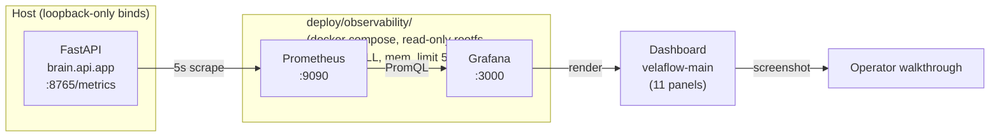

Start it with:

```bash
uvicorn brain.api.app:app --host 127.0.0.1 --port 8765 &
docker compose -f deploy/observability/docker-compose.yml up -d
# open http://127.0.0.1:3000/d/velaflow-main (admin/admin)
```

