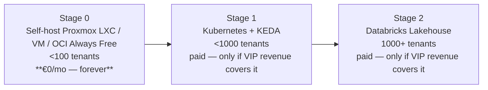

# VelaFlow — Scaling Path

This document is the formal architecture answer to the question raised in the
R21 review: *"what would the migration to a cloud-native, auto-scaling
deployment look like if user demand grows?"*

It is a **design document**, not a running system. The running system is
the self-hosted container described in [`architecture.md`](architecture.md).
This document exists so that the migration is well-defined ahead of time.

---

## Stages

**Zero-cost is non-negotiable at Stage 0.** Stage 1 and Stage 2 introduce
paid infrastructure and are only entered if paid VIP revenue already
covers the incremental bill — the maintainer must never pay out of pocket
to serve free or standard users.

Stage 0 is a single *logical* tier. The three Terraform targets under
`deploy/terraform/` (proxmox / generic-vm / oracle-cloud) are all Stage 0:
they install the same container stack on whichever **free** host the
operator owns today. They are equal-status — Stage 0 is not "try OCI
first" — and moving between them is a `terraform apply` in a different
target directory.

### Stage 0 — Self-host on any free Linux host (today)

- Single container, DuckDB + SQLite, embedded `TenantScheduler` or
  `systemd` timers.
- Three interchangeable **€0** deploy targets, all declarative Terraform:
  - `deploy/terraform/proxmox/` — unprivileged LXC on a homelab Proxmox
    node (Intel N95 / 8 GB is the hardware floor). Self-hosted hardware.
  - `deploy/terraform/generic-vm/` — any SSH-reachable Linux host the
    operator already owns (home server, VPS already paid for other
    reasons, LXC guest on existing hardware).
  - `deploy/terraform/oracle-cloud/` — OCI **Always Free** Ampere A1.Flex
    VM (4 OCPU / 24 GB RAM, free forever per OCI's published Always Free
    tier).
- All three call the same `modules/velaflow-host/` module, so the install
  on disk is bit-identical regardless of where the host came from.
- `scripts/install.sh` remains as a dev-only quick-start.
- Drives the privacy-first and €0-operator promises.

### Stage 1 — Kubernetes + KEDA (the review's target)

At this point the single-VM model runs out of headroom and multiple
tenants' pipelines compete for the same Python process. The migration is:

| Concern                    | Stage 0 (host)                       | Stage 1 (managed Kubernetes)                             |
|----------------------------|--------------------------------------|----------------------------------------------------------|
| API tier                   | Uvicorn on systemd                   | `deploy/kubernetes/deployment-api.yaml` + HPA            |
| Worker tier                | Embedded `TenantScheduler`          | `deploy/kubernetes/deployment-worker.yaml` + **KEDA**   |
| Autoscaling signal         | —                                    | KEDA `ScaledObject` on queue depth (`deploy/kubernetes/keda-scaler.yaml`) |
| Ingress                    | Nginx on the host                    | Managed ingress controller + cert-manager                |
| LiteLLM proxy              | Local container                      | Private cluster + private link to the secrets vault      |
| Secrets                    | `VELAFLOW_CREDENTIAL_PEPPER` in env | Cloud KMS-backed CSI volume                              |
| Network                    | Public IP + admin CIDR               | Managed VNet / VPC injection + private link              |

KEDA is the explicit scaling primitive: the worker pool scales from
0 → N replicas based on the pending-task queue depth, then back to 0
when idle. This is already wired in `deploy/kubernetes/keda-scaler.yaml`.

Stage 1 is **cloud-vendor-neutral**: the K8s manifests work on any
conformant cluster (AKS, EKS, GKE, self-managed). No Stage-1 Terraform
target is shipped in this repo — the Stage 0 host targets are the only
Terraform VelaFlow bundles, by design (see ADR 0003).

### Stage 2 — Databricks Lakehouse (design only)

Triggered by the conditions in [ADR 0001](adr/0001-duckdb-sqlite-vs-databricks.md):
tenants > 500, ingest > 5 GB / tenant / day, or regulated-customer
requirements.

| VelaFlow primitive (today)   | Databricks primitive (at scale)                 |
|------------------------------|--------------------------------------------------|
| `systemd-timers` / scheduler | **Databricks Autoloader** on cloud object store |
| Bronze / Silver / Gold files | Delta Lake tables, same layer names              |
| SQLite catalog               | **Unity Catalog** metastore                      |
| Per-tenant `WHERE tenant_id` | Unity **row-level filters** + catalog RBAC       |
| DuckDB VSS (`brain.rag`)     | **Databricks Vector Search** on Gold Delta      |
| LiteLLM proxy on K8s         | Mosaic AI Gateway + model serving endpoints      |
| Kubernetes manifests         | **Databricks Asset Bundles** (DABs) for code     |

The pipeline contract (layer names, column names, processing order) is
identical on either engine, so Stage 2 is a driver change, not a rewrite.

---

## Non-goals

- Running a heavyweight Kubernetes cluster on the home lab to "prove" the
  Stage 1 design works. Stage 1 is declarative in `deploy/kubernetes/`;
  that is proof enough. Burning the operator's 6 GB of RAM on a control
  plane would contradict the €0 promise.
- Shipping a cloud-vendor-specific Terraform module for Stage 1. The
  Stage 0 host targets stay portable; Stage 1 is decided at migration
  time against whichever managed-Kubernetes vendor the operator chooses.
- Migrating to Databricks before any trigger in ADR 0001 fires.
