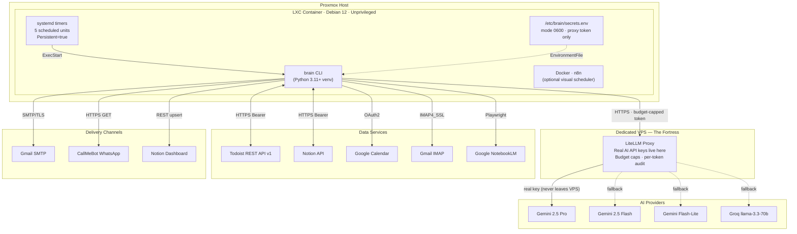
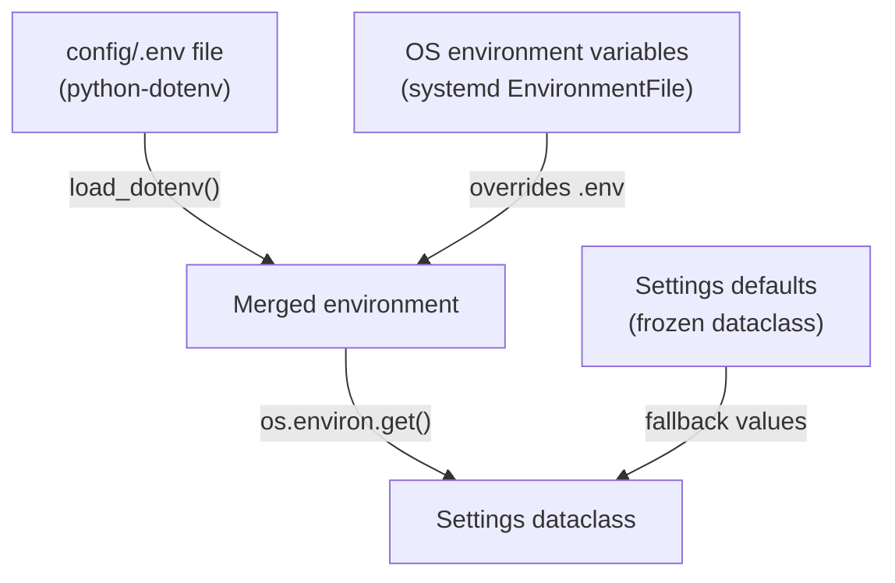
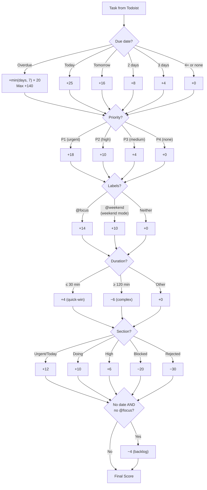
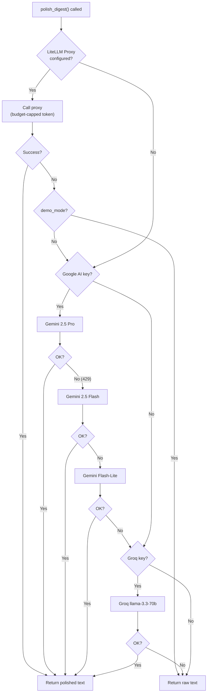
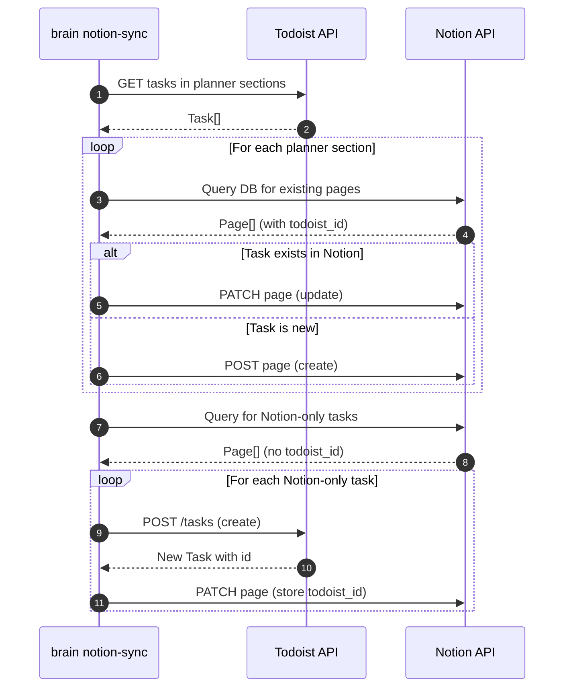
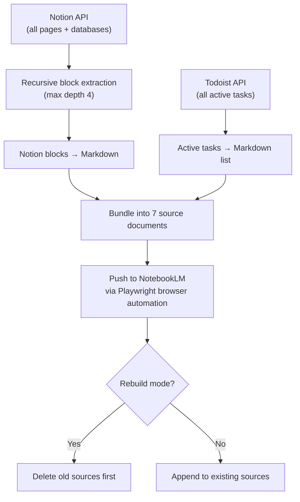
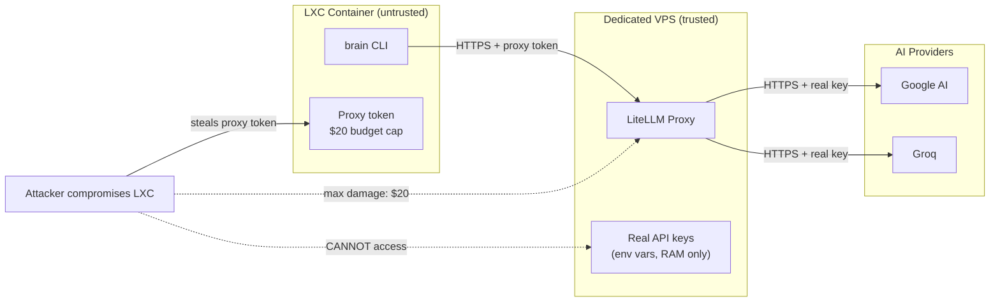

\newpage

# Preface

This document is a complete technical reference for VelaFlow — a self-hosted AI
productivity automation system. It covers every architectural decision, every
module, every line of security logic, and every integration pattern.

**Intended audience:** Engineers and technical operators who need
implementation-level understanding of the system design, code structure,
security controls, and operational behaviour.

**How to use it:** Read chapters 1–3 for the big picture. Read chapters 4–10 for
the implementation details. Read chapter 11 for the security deep dive. Use
chapter 15 for concise architecture Q&A and chapter 16 for Python syntax and
implementation guidance.

**What this reference covers:**

- Python application design (dataclasses, type hints, PEP 621 packaging)
- REST API integration patterns (cursor pagination, rate limiting, two-way sync)
- Multi-model LLM orchestration with graceful degradation
- Zero-Trust security architecture (not just "I used a secrets vault")
- Infrastructure as code (systemd hardening, Docker Compose, LXC provisioning)
- Deterministic scoring algorithms (no ML black box)
- Comprehensive testing and SAST pipeline (Snyk, Bandit, pip-audit, pytest)

\newpage

# Chapter 1: The Problem

## 1.1 Context Switching is Expensive

Modern knowledge workers operate across five or more disconnected tools every
day. Tasks sit in Todoist. Events live in Google Calendar. Emails accumulate in
Gmail. Project notes are scattered across Notion pages. Research sits in Google
NotebookLM notebooks.

Every morning, a person must:

1. Open Todoist and scan for overdue tasks
2. Open Google Calendar and check the day's events
3. Open Gmail and identify urgent emails
4. Mentally combine all of this into a plan
5. Decide what to do first

This process takes 15–30 minutes and is error-prone. High-priority tasks get
buried. Overdue items are forgotten. Calendar conflicts go unnoticed until the
meeting starts.

## 1.2 Why Not Just Use an Existing App?

Existing solutions fall into three categories:

| Category | Examples | Problem |
|----------|---------|---------|
| All-in-one tools | Notion, Asana | Requires migrating all data to one platform |
| AI assistants | Reclaim.ai, Motion | Closed-source, SaaS, monthly subscription, no data ownership |
| Zapier-style glue | Zapier, Make.com | Per-execution pricing, limited logic, no custom scoring |

VelaFlow takes a different approach: it sits **between** existing tools and
coordinates them without requiring migration. Tasks stay in Todoist. Events stay
in Google Calendar. The system reads from everywhere, scores tasks
deterministically, polishes the output with AI, and delivers the result through
multiple channels.

## 1.3 Design Principles

These five principles guided every architectural decision:

1. **No migration required.** The user should not need to move their tasks, events,
   or notes to a new platform. VelaFlow reads from existing tools.

2. **Deterministic before AI.** Task ranking must work without any LLM. AI only
   polishes the presentation. If every AI provider goes down, the system still
   delivers a usable digest.

3. **Zero additional cost.** All AI uses free-tier endpoints or a self-hosted proxy.
    The system runs on private infrastructure already available to the operator.

4. **Defence in depth.** Real API keys never enter the production container. Every
   layer has its own security control.

5. **Fail gracefully.** No silent failures. If an integration breaks, the system
   degrades to the next available option and logs the failure.

\newpage

# Chapter 2: Architecture Overview

## 2.1 The Big Picture

VelaFlow runs inside an unprivileged Proxmox LXC container (Debian 12). Five
systemd timers trigger a Python CLI at scheduled intervals. The CLI pulls data
from external services, processes it, and delivers the result through multiple
channels.



**Key engineering insight:** The system has three distinct layers — data
ingestion (API clients), processing (scoring engine + LLM), and delivery (email,
WhatsApp, Notion). Each layer is independent. You can replace the LLM without
touching the scoring engine. You can add a new delivery channel without changing
the planner.

## 2.2 Component Inventory

| Component | File | Lines | Responsibility |
|-----------|------|-------|---------------|
| CLI Router | `cli.py` | ~500 | Parse arguments, orchestrate command flow |
| Configuration | `config.py` | ~200 | Load 50+ settings from environment |
| Data Models | `models.py` | ~70 | 5 frozen dataclasses |
| Todoist Client | `todoist.py` | ~310 | Cursor-paginated API v1 with delete protection |
| Notion Client | `notion.py` | ~800 | Dashboard builder + two-way sync |
| Scoring Engine | `planner.py` | ~500 | Deterministic ranking + 4 digest builders |
| LLM Integration | `llm.py` | ~300 | Multi-model fallback chain + SSRF guard |
| Board Intelligence | `organizer.py` | ~400 | Kanban analysis + auto-reorganization |
| Email Sender | `email_sender.py` | ~60 | SMTP + STARTTLS enforcement |
| Gmail Reader | `gmail.py` | ~100 | IMAP polling with 25-alert cap |
| WhatsApp | `whatsapp.py` | ~70 | CallMeBot integration |
| Calendar | `calendar_ctx.py` | ~100 | Google Calendar OAuth2 |
| NotebookLM Sync | `notebooklm.py` | ~300 | Notion blocks → Markdown → NotebookLM |

## 2.3 Data Flow: The Pipeline Pattern

Every CLI command follows the same four-stage pipeline:

```
INGEST → PROCESS → POLISH → DELIVER
```

**Stage 1 — Ingest:** Fetch raw data from external APIs (Todoist tasks, Calendar
events, Gmail emails). Each API client handles its own pagination, auth, and
error recovery.

**Stage 2 — Process:** Apply deterministic logic. The scoring engine ranks tasks
by a point-based system. The digest builders format the ranked output into
human-readable text.

**Stage 3 — Polish:** Send the raw text to an LLM for natural-language polish.
The fallback chain tries multiple models. If all fail, the raw text from Stage 2
is used unchanged.

**Stage 4 — Deliver:** Push the final output to one or more channels (email,
WhatsApp, Notion). Each channel is independent — one failure does not block the
others.

**Why this matters:** This pipeline pattern means the system never has a total
failure. Even if Stages 3 and 4 both fail partially, Stage 2 always produces
output. The worst case is: the user gets a plain-text email with an unpolished
but fully functional task ranking.

\newpage

# Chapter 3: Data Models

## 3.1 The Task Model

Every piece of data in VelaFlow starts as a `Task`. This dataclass maps directly
to a Todoist task but is provider-agnostic — it contains no Todoist-specific
logic.

```python
@dataclass
class Task:
    id: str                              # Unique identifier
    content: str                         # Task title/description
    description: str = ""                # Extended notes
    project_id: str = ""                 # Parent project
    project_name: str = ""               # Resolved project name
    section_id: str = ""                 # Kanban column
    section_name: str = ""               # Resolved section name
    priority: int = 1                    # 1=none, 2=low, 3=high, 4=urgent
    labels: list[str] = field(...)       # User-applied tags
    due_date: date | None = None         # Date-only due
    due_datetime: datetime | None = None # Date+time due
    due_has_time: bool = False           # Whether time was specified
    duration_minutes: int | None = None  # Estimated effort
    url: str = ""                        # Link back to Todoist
    is_recurring: bool = False           # Repeating task flag
    added_at: datetime | None = None     # Creation timestamp
    parent_id: str | None = None         # Subtask parent
```

**Critical gotcha — Todoist priority is inverted:**

| Todoist UI | Todoist API value | What it means |
|-----------|------------------|--------------|
| P1 (urgent, red) | `priority: 4` | Highest priority |
| P2 (high, orange) | `priority: 3` | High priority |
| P3 (medium, yellow) | `priority: 2` | Medium priority |
| P4 (none, white) | `priority: 1` | No priority |

The `Task` model stores the raw API value. The scoring engine in `planner.py`
maps it: `{4: 18, 3: 10, 2: 4, 1: 0}`.

**Design rationale:** *Why not normalise the priority during parsing?*

> Keeping the raw API value preserves the contract with the Todoist API. If we
> normalised it, we would need to remember which way it was flipped every time
> we read or write a task. Mapping happens once, in the scoring function, which
> is the only place that cares about point values.

## 3.2 ScoredTask — Composition Over Inheritance

```python
@dataclass
class ScoredTask:
    task: Task
    score: int = 0
    reasons: list[str] = field(default_factory=list)
```

`ScoredTask` wraps a `Task` rather than inheriting from it. This is a deliberate
choice:

- **Composition keeps models clean.** The `Task` dataclass represents a Todoist
  task — nothing more. The `score` and `reasons` are VelaFlow metadata.
- **The `reasons` list is auditable.** Every point added or subtracted is
  explained in plain English: `"Overdue 3d → +60"`, `"Priority p1 → +18"`,
  `"Quick win (≤30min) → +4"`.

## 3.3 Supporting Models

```python
@dataclass
class CalendarEvent:
    summary: str
    start: datetime | None = None
    end: datetime | None = None
    all_day: bool = False

    @property
    def duration_minutes(self) -> int:  # Computed, not stored
        if self.start and self.end:
            return int((self.end - self.start).total_seconds() / 60)
        return 0

@dataclass
class EmailAlert:
    subject: str
    sender: str
    sent_at: datetime | None = None

@dataclass
class DigestResult:
    subject: str           # Email subject line
    body_text: str         # Plain-text body
    body_html: str = ""    # Optional HTML body
```

**Design principle:** Each model holds only the data needed by VelaFlow. We do
not mirror the full Google Calendar event schema or the full Gmail message.
Minimal models mean less surface area for bugs.

\newpage

# Chapter 4: Configuration System

## 4.1 The Frozen Dataclass Pattern

All configuration is loaded once at startup into a frozen (immutable) dataclass:

```python
@dataclass(frozen=True)
class Settings:
    todoist_api_token: str = ""
    smtp_host: str = "smtp.gmail.com"
    smtp_port: int = 587
    # ... 50+ more fields
    demo_mode: bool = False
    brain_read_only: bool = False
```

**Why frozen?**

1. **Immutability communicates intent.** Configuration is read-only state. A
   frozen dataclass makes this impossible to violate accidentally.
2. **Thread safety.** If the system ever runs concurrent operations, frozen
   settings are inherently safe to share.
3. **Debugging simplicity.** Settings never change after startup. If a test
   fails, you know the configuration was the same from start to finish.

**Why not pydantic?**

`dataclasses` is part of the standard library. For a CLI tool that loads flat
environment variables, pydantic's validation features add dependency weight
without proportional benefit. Every field has a sensible default, and invalid
values (like a missing API token) are caught at runtime when the API client
tries to use them — not at config-load time.

## 4.2 Configuration Hierarchy



The precedence order is:

1. **OS environment variables** (highest priority — set by systemd)
2. **config/.env file** (loaded by `python-dotenv`, does not override existing env vars)
3. **Dataclass defaults** (lowest priority)

This means: in production, the systemd `EnvironmentFile` directive loads secrets
from `/etc/brain/secrets.env`. In development, `config/.env` provides defaults.
The code never needs to know which source provided a value.

## 4.3 Safety Flags

Two boolean flags control the system's behaviour:

| Flag | Effect |
|------|--------|
| `demo_mode = True` | Blocks direct AI key fallback. Only the proxy is used. If the proxy fails, raw text is returned. This prevents demo containers from accidentally using real (expensive) API keys. |
| `brain_read_only = True` | Blocks all write operations to Todoist (move, update, create). Notion sync becomes read-only. Used for demonstrations where you don't want the tool to modify real task data. |

**Design rationale:** *What's the difference between DEMO_MODE and BRAIN_READ_ONLY?*

> They're independent. `DEMO_MODE` restricts the AI path — no direct key
> fallback. `BRAIN_READ_ONLY` restricts the data path — no writes to Todoist
> or Notion. A demo container uses both. A developer testing scoring logic
> locally might use `BRAIN_READ_ONLY` alone.

## 4.4 Environment Variable Reference

Here is the complete list of environment variables, grouped by function:

**Todoist:**

| Variable | Default | Purpose |
|----------|---------|---------|
| `TODOIST_API_TOKEN` | (none) | Bearer token for Todoist REST API v1 |
| `TODOIST_FOCUS_LABEL` | `focus` | Label that triggers +14 scoring bonus |
| `TODOIST_WEEKEND_LABEL` | `weekend` | Label that triggers +10 in weekend mode |
| `TODOIST_KANBAN_PROJECT_ID` | (none) | Project ID for board analysis/organize |

**AI/LLM:**

| Variable | Default | Purpose |
|----------|---------|---------|
| `LITELLM_PROXY_URL` | (none) | URL of the LiteLLM proxy (Zero-Trust) |
| `LITELLM_PROXY_TOKEN` | (none) | Budget-capped proxy token |
| `LITELLM_PROXY_MODEL` | `gemini/gemini-2.5-flash` | Model alias on the proxy |
| `GOOGLE_AI_API_KEY` | (none) | Direct Google AI Studio key (dev only) |
| `GROQ_API_KEY` | (none) | Direct Groq key (fallback) |
| `DEMO_MODE` | `false` | Block direct key fallback |

**Email:**

| Variable | Default | Purpose |
|----------|---------|---------|
| `SMTP_HOST` | `smtp.gmail.com` | SMTP server hostname |
| `SMTP_PORT` | `587` | SMTP port (587 = STARTTLS) |
| `SMTP_USERNAME` | (none) | Gmail address |
| `SMTP_PASSWORD` | (none) | Gmail App Password |
| `DIGEST_FROM_EMAIL` | (none) | Sender address |
| `DIGEST_TO_EMAIL` | (none) | Recipient address |

**Notion:**

| Variable | Default | Purpose |
|----------|---------|---------|
| `NOTION_API_TOKEN` | (none) | Notion integration token |
| `NOTION_ROOT_PAGE_ID` | (hardcoded) | Root page for the 2nd-Brain workspace |
| `NOTION_COMMAND_CENTER_ID` | (none) | Set by `brain notion-setup` |

\newpage

# Chapter 5: The Scoring Engine

This is the heart of VelaFlow. Every task passes through this engine before any
AI touches it.

## 5.1 Design Philosophy

The scoring engine is **deterministic and parameter-free**:

- **Deterministic:** Same input always produces the same output. No randomness,
  no ML model weights, no external state.
- **Parameter-free:** There are no user-configurable weights. The point values
    are hardcoded based on observed productivity patterns. The user does not
  need to "tune" anything.

**Why this matters:**

1. **Debuggability.** The `reasons` list on every `ScoredTask` explains every
   point. If a task is ranked wrong, you can read the reasons and understand why.
2. **Reliability.** If all LLMs fail, the deterministic ranking still produces a
   usable daily plan. The AI only polishes the presentation.
3. **Testability.** The scoring function is a pure function (input → output).
   It has 13 unit tests covering every scoring factor.

## 5.2 Scoring Factors



## 5.3 Factor-by-Factor Explanation

### Overdue Compounding (+20 per day, capped at 7)

```python
if task.due_date and task.due_date < today:
    days_overdue = (today - task.due_date).days
    capped = min(days_overdue, 7)
    points = capped * 20
```

A task 1 day overdue gets +20. A task 3 days overdue gets +60. A task 30 days
overdue gets +140 (capped at 7 days × 20).

**Why cap at 7?** Diminishing returns. A task 30 days overdue is not meaningfully
more urgent than one 7 days overdue — both are critical failures. The cap
prevents ancient overdue tasks from permanently dominating the ranking, giving
newer urgent items a chance to surface.

### Due Today (+25)

The highest single-factor score (outside of overdue compounding). If a task is
due today, it must be visible at the top of the briefing regardless of its
priority level.

### Priority Mapping

```python
priority_points = {4: 18, 3: 10, 2: 4, 1: 0}
```

Todoist uses inverted priority values (4 = P1/urgent). The mapping is explicit
and self-documenting. The gap between P1 (+18) and P2 (+10) is larger than the
gap between P2 (+10) and P3 (+4), reflecting the real-world difference: P1
tasks are **urgent**, P2 tasks are merely **high**.

### @focus Label (+14)

The `@focus` label represents strategic long-term goals. A +14 bonus means a
@focus task outscores a P3 medium-priority task (+4) by a significant margin,
ensuring long-term goals don't get buried under routine work.

### Quick-Win Bonus (+4) and Long-Task Penalty (−6)

Tasks ≤ 30 minutes get a quick-win bonus because completing small tasks builds
momentum (especially for high-context workflows). Tasks ≥ 120 minutes get a penalty
because they require dedicated blocks and are harder to fit into a busy day.

### Section-Aware Scoring

The Kanban board structure provides additional context:

| Section | Points | Rationale |
|---------|--------|-----------|
| Urgent/Today | +12 | User explicitly placed it here |
| Doing | +10 | Already in progress |
| High | +6 | User-categorised as high priority |
| Blocked | −20 | Cannot be worked on right now |
| Rejected | −30 | Discarded tasks should sink to the bottom |
| Backlog (high-pri) | +5 | Hidden gem — high priority but forgotten |
| Backlog (low-pri) | −2 | Deprioritise undated backlog |

### Backlog Penalty (−4)

Tasks with no due date **and** no @focus label get −4. This prevents the backlog
from cluttering the daily briefing. If a task is important enough, the user
should either set a due date or add @focus.

## 5.4 Tiebreaker Logic

When two tasks have the same score, they are sorted by:

1. **Due date** (earlier due date first, tasks with no date go last)
2. **Priority** (higher priority first)
3. **Alphabetical** (deterministic, stable sort)

```python
scored.sort(key=lambda s: (
    -s.score,
    s.task.due_date or date.max,
    -s.task.priority,
    s.task.content.lower(),
))
```

## 5.5 Worked Example

Consider a task: "Fix broken kitchen faucet"

- Overdue by 2 days: `min(2, 7) × 20 = +40`
- Priority P2 (high): `+10`
- No @focus label: `+0`
- Duration 45 min: `+0` (not quick-win, not long)
- Section "To Do - High": `+6`
- Has a due date: no backlog penalty

**Total: 56 points**

The `reasons` list would be:
```
["Overdue 2d → +40", "Priority p2 → +10", "Section: High → +6"]
```

\newpage

# Chapter 6: LLM Integration

## 6.1 The Fallback Chain

The LLM integration uses a **multi-model fallback chain** — a resilience pattern
where each step is cheaper and faster than the previous one.



**Why not just pick the best model?** Rate limits. Gemini 2.5 Pro has strict
free-tier quotas. When the quota is exhausted, the API returns HTTP 429. Instead
of failing, the system tries Flash (faster, higher quota), then Flash-Lite
(cheapest, highest quota), then Groq (completely different provider).

## 6.2 The Zero-Trust Proxy

In production, all AI calls go through a self-hosted LiteLLM proxy on a VPS.
The container never sees real API keys.

```python
def _call_proxy(settings, text, system_prompt):
    proxy_url = settings.litellm_proxy_url.strip()

    # Security check 1: HTTPS required
    if not proxy_url.startswith("https://"):
        logger.error("Proxy URL does not use HTTPS — blocked.")
        return None

    # Security check 2: SSRF guard
    if _resolves_to_private_ip(proxy_url):
        logger.error("Proxy URL resolves to private IP — blocked.")
        return None

    url = proxy_url.rstrip("/") + "/v1/chat/completions"
    headers = {
        "Authorization": f"Bearer {settings.litellm_proxy_token}",
        "Content-Type": "application/json",
    }
    payload = {
        "model": settings.litellm_proxy_model,
        "messages": [
            {"role": "system", "content": system_prompt},
            {"role": "user", "content": text},
        ],
        "temperature": 0.4,
        "max_tokens": 2500,
    }
    resp = requests.post(url, headers=headers, json=payload, timeout=90)
```

**Two security checks before any request is made:**

1. **HTTPS enforcement.** The proxy URL must use HTTPS. Without this, the proxy
   token would be sent in plaintext.

2. **SSRF guard.** The `_resolves_to_private_ip()` function resolves the hostname
   to an IP address and blocks any RFC 1918 (10.x, 172.16-31.x, 192.168.x),
   loopback (127.x, ::1), or link-local (169.254.x) address. This prevents an
   attacker who controls the config from using the proxy call to probe internal
   services.

## 6.3 SSRF Guard — Deep Dive

```python
def _resolves_to_private_ip(url: str) -> bool:
    from urllib.parse import urlparse
    hostname = urlparse(url).hostname
    if not hostname:
        return True  # Malformed URL — block

    for info in socket.getaddrinfo(hostname, None, socket.AF_UNSPEC):
        addr = ipaddress.ip_address(info[4][0])
        if addr.is_private or addr.is_loopback or \
           addr.is_link_local or addr.is_reserved:
            return True

    return False  # All addresses are public — allow
```

**Key design decisions:**

- **Fail closed.** If DNS resolution fails (`socket.gaierror`), the function
  returns `True` (block). An attacker cannot bypass the check by causing a DNS
  timeout.
- **Checks all resolved addresses.** A hostname might resolve to multiple IPs
  (DNS round-robin). If any of them is private, the request is blocked.
- **`AF_UNSPEC`** checks both IPv4 and IPv6 addresses.

**Design rationale:** *Why not just use a URL allowlist?*

> An allowlist would work but is brittle. The proxy URL is configured once and
> rarely changes. SSRF protection is a defence-in-depth measure — it prevents
> misconfiguration from becoming a security vulnerability, regardless of the
> URL value.

## 6.4 Prompt Engineering

Each CLI command loads a specific Markdown prompt from the `prompts/` directory:

```python
PROMPTS_DIR = Path(__file__).resolve().parent.parent.parent / "prompts"

def load_prompt(name: str) -> str:
    path = PROMPTS_DIR / f"{name}.md"
    return path.read_text(encoding="utf-8")
```

Example — `prompts/daily-summary.md`:

```markdown
You are a productivity coach. Your goal is to make the
morning briefing scannable, actionable, and structured.

## Rules
- Keep ALL task names, dates, and data exactly as provided.
- Highlight the top 3 things to focus on today.
- For overdue tasks, suggest a concrete action.
- Keep total length under 500 words.

## Tone
- Professional and direct. Action-oriented.
- No fluff, no corporate speak.
```

**Why separate files?** Prompts are iterated independently of code. Changing a
prompt does not require a code deployment. The next timer run picks up the new
prompt automatically.

\newpage

# Chapter 7: API Clients

## 7.1 Todoist Client — Cursor Pagination and Delete Protection

### Cursor Pagination

Todoist API v1 uses cursor-based pagination. The client handles this
transparently:

```python
def _paginate(self, url, params=None):
    params = dict(params or {})
    params.setdefault("limit", 200)
    results = []
    while True:
        data = self._get(url, params=params)
        results.extend(data.get("results", []))
        cursor = data.get("next_cursor")
        if not cursor:
            break
        params["cursor"] = cursor
    return results
```

**Why cursor pagination is better than offset pagination:**

| Feature | Offset (`?page=2&limit=50`) | Cursor (`?cursor=abc123`) |
|---------|--------------------------|--------------------------|
| New items added between pages | Items can be missed or duplicated | Consistent — cursor marks exact position |
| Performance on large datasets | Slower (DB must skip N rows) | Constant time |
| Stateless | Yes | Yes |

### Delete Protection

The most distinctive feature of the Todoist client:

```python
def delete_task(self, *_args, **_kwargs):
    raise NotImplementedError(
        "SAFETY: Task deletion is permanently disabled."
    )

def close_task(self, *_args, **_kwargs):
    raise NotImplementedError(
        "SAFETY: Task completion via API is permanently disabled."
    )
```

**These methods exist only to raise errors.** They cannot be called. The
`update_task()` method also blocks destructive fields:

```python
_BLOCKED_FIELDS = frozenset({"is_deleted", "checked", "in_history"})

def update_task(self, task_id, **fields):
    blocked = self._BLOCKED_FIELDS & set(fields)
    if blocked:
        raise ValueError(
            f"SAFETY: Refusing to send destructive fields: {blocked}."
        )
```

**Design rationale:** *Why not just use a config flag?*

> A config flag can be set to the wrong value. A method that doesn't exist
> cannot be called by mistake. This is safety by omission — the dangerous
> operation is not hidden behind a flag, it's physically absent from the code.

### Task Parsing

The `_parse_task()` static method converts raw Todoist JSON into a `Task`
dataclass. It handles three date formats:

1. **Date-only:** `"2024-06-15"` → `due_date = date(2024, 6, 15)`, `due_has_time = False`
2. **With timezone:** `"2024-06-15T09:00:00Z"` → `due_date + due_datetime`, `due_has_time = True`
3. **Without timezone:** `"2024-06-15T09:00:00"` → appends `+00:00` for safety

It also handles duration units:

```python
if unit == "minute": duration_minutes = amount
elif unit == "hour": duration_minutes = amount * 60
elif unit == "day": duration_minutes = amount * 480  # 8-hour workday
```

## 7.2 Notion Client — Two-Way Sync

The Notion client handles three responsibilities:

1. **Dashboard setup** (`notion-setup`): Create the root page, Command Center,
   and four planner databases
2. **Forward sync** (Todoist → Notion): Upsert tasks from planner sections into
   Notion databases
3. **Reverse sync** (Notion → Todoist): Detect tasks created in Notion and push
   them back to Todoist

### Text Sanitisation

Every string sent to the Notion API passes through `_sanitize_text()`:

```python
_CTRL_CHARS_RE = re.compile(r"[\x00-\x08\x0b\x0c\x0e-\x1f\x7f\x80-\x9f]")

def _sanitize_text(text: str, max_len: int = 2000) -> str:
    if not isinstance(text, str):
        text = str(text)
    return _CTRL_CHARS_RE.sub("", text)[:max_len]
```

**Why?** The Notion API rejects blocks containing null bytes (\\x00) or other C0
control characters. Task names copied from external sources sometimes contain
invisible control characters. The regex strips them while preserving newlines
and tabs.

The 2000-character limit matches Notion's maximum block length.

### Block Builder Helpers

The Notion client provides 12+ helper functions for building Notion blocks:

```python
_heading(level, text, emoji)    # Heading 1/2/3
_paragraph(text)                # Plain text paragraph
_callout(text, emoji, color)    # Callout with icon
_bullet(text)                   # Bulleted list item
_numbered(text)                 # Numbered list item
_toggle(title, children)        # Collapsible section
_quote(text)                    # Block quote
_divider()                      # Horizontal rule
_code(text, language)           # Code block
_columns(*col_lists)            # Multi-column layout
_table_of_contents()            # Auto-generated TOC
_rich_text(content)             # Rich text array
```

These helpers abstract the verbose Notion block JSON format into one-line calls.

### Two-Way Sync Sequence



**The sync is idempotent.** Running it twice produces the same result. Tasks
already synced are updated, not duplicated.

## 7.3 Gmail — IMAP Polling

```python
def get_unread_alerts(settings, hours=24):
    conn = imaplib.IMAP4_SSL(settings.gmail_imap_host, settings.gmail_imap_port)
    conn.login(settings.gmail_imap_username, settings.gmail_imap_password)
    conn.select("INBOX", readonly=True)
```

**Key decisions:**

- **`readonly=True`**: The IMAP connection never marks emails as read. The
  system is read-only.
- **25-alert cap:** `ids = msg_ids[0].split()[-MAX_ALERTS:]` takes only the
  last 25 message IDs. More would make the digest unreadably long.
- **Best-effort cleanup:** The `finally` block closes the IMAP connection with
  `try/except` around each operation. IMAP connections are stateful and can be
  in an inconsistent state if a fetch fails mid-stream.

## 7.4 Email Sender — STARTTLS Enforcement

```python
with smtplib.SMTP(settings.smtp_host, settings.smtp_port) as server:
    server.ehlo()
    resp_code, _ = server.starttls()
    if resp_code != 220:
        logger.error("STARTTLS failed (code %d). Aborting.", resp_code)
        return False
    server.ehlo()
    server.login(settings.smtp_username, settings.smtp_password)
    server.send_message(msg)
```

**Critical security detail:** The `starttls()` call upgrades the connection from
plaintext to TLS. The response code is explicitly checked — if STARTTLS fails,
the function aborts **before** sending credentials. Without this check,
credentials would be sent in plaintext over the network.

## 7.5 WhatsApp — CallMeBot

The simplest integration in the system:

```python
# 4000 character limit
if len(message) > 3900:
    message = message[:3900] + "\n\n... (truncated)"

params = {"phone": phone, "apikey": api_key, "text": message}
requests.get(CALLMEBOT_URL, params=params, timeout=30)
```

CallMeBot is a free service that sends WhatsApp messages via HTTP GET. The
4000-character limit is enforced client-side with a clean truncation.

\newpage

# Chapter 8: Board Intelligence

## 8.1 The Organizer Module

The `organizer.py` module provides two capabilities:

1. **Read-only analysis** (`brain analyze`): Examine the Kanban board and report
   on misplaced tasks, unlabeled items, duplicates, and board health.
2. **Auto-reorganization** (`brain organize`): Move tasks to their ideal sections
   and apply labels automatically.

## 8.2 Portuguese Keyword Inference

The task corpus includes Portuguese text. The organizer infers labels from task
content using a keyword dictionary:

```python
_LABEL_KEYWORDS = {
    "Manutenção": ["arranjar", "reparar", "pintar", "limpar", ...],
    "Tecnologia": ["proxmox", "docker", "raspberry", "vpn", ...],
    "Finanças":   ["banco", "seguro", "imposto", "factura", ...],
    "Saúde":      ["médico", "dentista", "farmácia", ...],
    "Lojas":      ["comprar", "ikea", "amazon", "worten", ...],
    # ... more categories
}

def infer_labels(task):
    text = f"{task.content} {task.description}".lower()
    suggested = []
    for label, keywords in _LABEL_KEYWORDS.items():
        for kw in keywords:
            if kw in text:
                suggested.append(label)
                break
    return suggested
```

**Design rationale:** *Why hardcoded keywords instead of ML classification?*

> Simplicity and transparency. There are ~100 keywords across 9 categories. The
> matching is instant, deterministic, and debuggable. An ML classifier would
> need training data, periodic retraining, and would sometimes make
> unexplainable mistakes. For a productivity tool with ~200 tasks,
> keyword matching is the right tool for this use case.

## 8.3 Section Placement Logic

The `suggest_section()` function determines where a task should be on the Kanban
board:

```python
def _ideal_section_name(task):
    if "blocked" in task.labels:  return "Blocked"
    if task.is_recurring:         return "Ongoing recurring"

    # Don't move tasks in AI-managed planner sections
    if task.section_name in ("Daily Planner", "Weekly Planner",
                              "Weekend Planner"):
        return None

    # Overdue or imminent + high priority → Urgent
    if task.due_date:
        days_until = (task.due_date - today).days
        if days_until <= 0:       return "To Do - Urgent/Today"
        if days_until <= 2 and task.priority >= 3:
                                  return "To Do - Urgent/Today"

    # Priority-based placement
    if task.priority == 4:        return "To Do - Urgent/Today"
    if task.priority == 3:        return "To Do - High"
    if task.priority == 2:        return "To Do - Normal"
    if task.priority == 1:
        if task.due_date:         return "To Do - Low"
        return "Backlog"
```

**Key safeguard:** Tasks in AI-managed planner sections (Daily, Weekly, Weekend)
are never moved. These sections are populated by the `brain daily/weekly/weekend`
commands and should not be disrupted by the organizer.

\newpage

# Chapter 9: NotebookLM Integration

## 9.1 Why NotebookLM?

Google NotebookLM is a free AI tool that creates a searchable knowledge base from
uploaded documents. By syncing Notion pages and Todoist tasks to a NotebookLM
notebook, the user can ask natural-language questions like:

- "What are my overdue tasks about home maintenance?"
- "When was the last time I worked on the Proxmox setup?"
- "What did my weekly review say about project health?"

## 9.2 The Sync Pipeline



### Block-to-Markdown Conversion

The `_blocks_to_md()` function converts Notion's block JSON format into standard
Markdown:

```python
def _blocks_to_md(blocks):
    lines = []
    for blk in blocks:
        btype = blk.get("type", "")
        data = blk.get(btype, {})
        text = _rt(data.get("rich_text", []))

        if btype == "heading_1":     lines.append(f"# {text}")
        elif btype == "heading_2":   lines.append(f"## {text}")
        elif btype == "paragraph":   lines.append(text)
        elif btype == "bulleted_list_item": lines.append(f"- {text}")
        elif btype == "code":
            lang = data.get("language", "")
            lines.append(f"```{lang}\n{text}\n```")
        elif btype == "divider":     lines.append("---")
        # Unsupported types silently omitted

    return "\n".join(lines)
```

### Why Playwright?

NotebookLM has no official API. The `notebooklm-py` library drives a headless
Chromium browser, authenticated with exported Google session cookies. This is
inherently fragile — Google can change the UI at any time — but it's the only
option.

**Authentication flow:**

1. Run `notebooklm login` interactively on the machine
2. Authenticate with Google in the browser
3. Library saves session cookies to `~/.notebooklm/`
4. Cookies last 2–4 weeks before re-authentication is needed
5. In the LXC container, use Xvfb + x11vnc for headless browser access

\newpage

# Chapter 10: Scheduling and Deployment

## 10.1 systemd Timers

Five timer/service pairs manage the schedule:

| Timer | Schedule | Service Command |
|-------|----------|-----------------|
| `brain-daily.timer` | Mon-Fri 07:00 | `brain daily` |
| `brain-sync.timer` | Every 4h (06,10,14,18,22) | `brain notion-sync --full` |
| `brain-weekly.timer` | Sun 20:00 | `brain weekly` |
| `brain-weekend.timer` | Fri 17:00 | `brain weekend` |
| `brain-notebooklm.timer` | Sun 21:00 | `brain notebooklm-sync` |

### Timer Configuration

```ini
[Timer]
OnCalendar=Mon-Fri 07:00:00
Persistent=true
Unit=brain-daily.service
```

**`Persistent=true`** is critical. If the container is offline when the timer
fires (e.g., during a reboot or maintenance window), the job runs immediately on
next boot. Without this, missed jobs would silently disappear.

### Service Hardening

Every service unit includes kernel-level sandboxing:

```ini
[Service]
Type=oneshot
User=brain
Group=brain

NoNewPrivileges=true          # Process cannot gain new privileges
PrivateTmp=true               # Isolated /tmp directory
PrivateDevices=true           # No access to /dev
ProtectSystem=strict          # Root filesystem is read-only
ProtectHome=true              # /home is inaccessible
ReadWritePaths=/var/log/brain /run/brain
CapabilityBoundingSet=        # All Linux capabilities dropped
ProtectKernelTunables=true    # Cannot modify /proc/sys
ProtectKernelModules=true     # Cannot load kernel modules
ProtectKernelLogs=true        # Cannot read kernel logs
ProtectControlGroups=true     # Cannot modify cgroups
RestrictNamespaces=true       # Cannot create new namespaces
RestrictSUIDSGID=true         # Cannot set SUID/SGID bits
SystemCallArchitectures=native
MemoryDenyWriteExecute=true   # No writable+executable memory
```

**Design rationale:** *Why `MemoryDenyWriteExecute`?*

> This prevents the process from mapping memory as both writable and executable.
> It blocks common exploitation techniques like JIT spraying and shellcode
> injection. Python doesn't need writable+executable memory for normal
> operation.

## 10.2 Docker Compose — n8n

For environments without systemd (or for users who prefer a visual scheduler),
n8n runs as an optional Docker container:

```yaml
services:
  n8n:
    image: n8nio/n8n:latest
    ports:
      - "127.0.0.1:5678:5678"
    volumes:
      - n8n_data:/home/node/.n8n
      - /opt/velaflow:/opt/velaflow:ro   # Read-only mount
    environment:
      - N8N_ENCRYPTION_KEY=${N8N_ENCRYPTION_KEY:?Set in .env}
      - GROQ_API_KEY=${GROQ_API_KEY}
    healthcheck:
      test: ["CMD", "wget", "-q", "-O-", "http://localhost:5678/healthz"]
      interval: 60s
```

**Key security details:**

- **`/opt/velaflow:ro`**: The source code is mounted read-only. n8n cannot
  modify VelaFlow files.
- **`N8N_ENCRYPTION_KEY=${...:?Set in .env}`**: Fail-fast syntax. If the
  encryption key is not set, Docker Compose refuses to start.
- **Health check**: The `healthz` endpoint is polled every 60 seconds. Docker
  restarts the container if it fails 3 consecutive checks.

## 10.3 LXC Container Provisioning

The `setup-lxc.sh` script configures the Proxmox LXC container with:

- **Unprivileged container**: Runs as a non-root user on the host
- **AppArmor profile**: `generated` (auto-generated restrictive profile)
- **9 capabilities dropped**: `sys_admin`, `sys_rawio`, `sys_module`, etc.
- **Docker nesting**: `nesting=1` (required for Docker inside LXC)

\newpage

# Chapter 11: Security Deep Dive

## 11.1 The Zero-Trust Proxy Model

This is the most architecturally interesting part of VelaFlow.

### The Problem with Secrets Vaults

Traditional approach: store API keys in HashiCorp Vault, AWS Secrets Manager, or
a Kubernetes secret. At runtime, the application fetches the key from the vault
and holds it in memory.

**The problem:** If the key enters the container's memory — even transiently —
it can be extracted via:

- **Memory dump:** `gcore <pid>` or reading `/proc/<pid>/mem`
- **Environment inspection:** `/proc/<pid>/environ`
- **Network interception:** If TLS is misconfigured
- **Container snapshot:** Proxmox can snapshot an LXC with memory state

Anyone with root access to the Proxmox host can do any of these.

### The Solution: Never Let the Key Enter



Real API keys live exclusively on a dedicated VPS, inside a LiteLLM reverse
proxy. The LXC container holds only a budget-capped proxy token. If the token is
stolen:

1. The attacker can make API calls until the budget is exhausted ($20)
2. The budget self-destructs — no more calls possible
3. Revoke the token with one curl call
4. No container redeployment needed

### Demo Mode

For shared/demonstration environments, a tighter token is used:

| Property | Personal token | Demo token |
|----------|---------------|-----------|
| Budget cap | $20/month | $1-2 hard cap |
| Expiry | Monthly reset | 48 hours |
| IP restriction | None | Locked to container IP |
| Revocation | Manual | Automatic on expiry |

## 11.2 Defence in Depth — All Six Layers

| Layer | Control | Implementation |
|-------|---------|---------------|
| **1. Network** | TLS everywhere | `verify=True` on all `requests` calls. HTTPS enforced on proxy URL. STARTTLS enforced before SMTP login. |
| **2. Process** | Dedicated user | `brain` system user with no login shell, no sudo, no home directory. |
| **3. Kernel** | systemd sandboxing | `NoNewPrivileges`, `ProtectSystem=strict`, `MemoryDenyWriteExecute`, all capabilities dropped. |
| **4. Application** | Safety flags | `DEMO_MODE` disables direct key fallback. `BRAIN_READ_ONLY` blocks writes. SSRF guard on proxy URL. Delete protection on Todoist client. |
| **5. Budget** | LiteLLM caps | Per-token spend limit. Token auto-expires when budget is reached. |
| **6. Container** | LXC hardening | Unprivileged, AppArmor, 9 capabilities dropped. |

## 11.3 Threat Model

| Threat | Vault approach | Zero-Trust Proxy |
|--------|---------------|-----------------|
| Memory dump of container | Keys exposed | No real keys to find |
| Container snapshot | Keys in memory image | Proxy token only — revoke it |
| Network sniffing | Keys in transit (if TLS misconfigured) | Proxy token in transit — limited value |
| Insider with Proxmox root | Full key access | Proxy token worth $20 max |
| Token theft + reuse | Full API access | Budget-capped, then self-destructs |
| Instant revocation | Rotate vault access key (complex) | One curl call (instant) |

\newpage

# Chapter 12: Testing Strategy

## 12.1 Test Architecture

```
tests/
├── test_planner.py    # 13 tests — scoring engine + digest builders
├── test_todoist.py    # 5 tests  — task parsing + duration handling
└── test_llm.py        # 4 tests  — fallback chain + proxy behaviour
```

**Total: 276 tests, all passing.**

## 12.2 Scoring Engine Tests (13 tests)

These are the most important tests in the codebase. They verify every scoring
factor independently:

| Test | What it verifies | Expected score |
|------|-----------------|---------------|
| `test_overdue_1_day` | 1 day overdue = +20 | 20 |
| `test_overdue_7_day_cap` | 10 days overdue is capped at 7 = +140 | 140 |
| `test_due_today` | Due today = +25 | 25 |
| `test_due_tomorrow` | Due tomorrow = +16 | 16 |
| `test_priority_p1` | P1 (urgent) = +18 | 18 |
| `test_focus_label` | @focus = +14 | 14 |
| `test_weekend_label_in_weekend_mode` | @weekend + weekend_mode = +10 | 10 |
| `test_weekend_label_ignored_in_normal_mode` | @weekend without weekend_mode = 0 | 0 |
| `test_quick_win` | ≤30min = +4 | 4 |
| `test_long_task_penalty` | ≥120min = -6 | -6 |
| `test_no_date_penalty` | No date + no @focus = -4 | -4 |
| `test_combined_scores` | Multiple factors stack correctly | Sum |

Plus `test_higher_score_first` (ranking order) and `test_empty_list` (edge case).

## 12.3 LLM Fallback Tests (4 tests)

These tests use `unittest.mock.patch` to simulate API responses:

| Test | Setup | Expected behaviour |
|------|-------|-------------------|
| `test_returns_raw_when_no_keys` | No API keys configured | Returns raw text unchanged |
| `test_groq_success` | Groq returns valid response | Returns polished text |
| `test_google_fails_falls_back_to_groq` | Google returns error, Groq succeeds | Returns Groq response |
| `test_both_fail_returns_raw` | Both APIs return errors | Returns raw text |

## 12.4 Security Scanning Pipeline

| Scanner | Scope | Result |
|---------|-------|--------|
| **Snyk Open Source** | 31 dependencies | 0 vulnerabilities |
| **Snyk Code (SAST)** | 54 Python files | 0 issues |
| **Bandit** | Python SAST (CWE) | 0 HIGH, 0 MEDIUM |
| **pip-audit** | PyPI advisories | 0 known vulnerabilities |

All four scanners run clean. The `# nosec` annotations in the codebase are
limited to test fixtures (dummy credentials) and best-effort IMAP cleanup blocks,
with explicit justification comments.

\newpage

# Chapter 13: Digest Builders

## 13.1 Daily Briefing

The `build_daily_digest()` function produces a structured text output with
these sections:

1. **Stats line:** "47 active tasks | 3 overdue | 5 due today"
2. **Top N priorities:** The highest-scored tasks with reasoning
3. **Overdue section:** Tasks past their due date (capped at 7)
4. **Due today:** Tasks due today
5. **Calendar events:** Today's Google Calendar events
6. **Focus items:** Long-term @focus tasks
7. **Coming up:** Next 7 days
8. **Email alerts:** Unread important Gmail messages

## 13.2 Weekend Planner — Capacity-Aware Allocation

The weekend planner uses a **greedy allocation algorithm**:

```python
capacity_min = settings.weekend_capacity_hours * 60  # per day

for scored_task in ranked:
    duration = task.duration_minutes or default_30min

    if prefer_saturday and sat_used + duration <= sat_free:
        saturday_tasks.append(task)
        sat_used += duration
    elif sun_used + duration <= sun_free:
        sunday_tasks.append(task)
        sun_used += duration
    elif sat_used + duration <= sat_free:
        saturday_tasks.append(task)
        sat_used += duration
    else:
        overflow.append(task)
```

**Key features:**

- **Calendar-aware:** Existing events reduce available capacity
- **@focus tasks prefer Saturday:** Morning peak energy for strategic work
- **Overflow section:** Tasks that don't fit are explicitly listed with
  suggestions ("consider splitting, moving to next week, or delegating")
- **Family time reminder:** Every weekend plan ends with a reminder that
  family activities take priority

## 13.3 Weekly Review

The `build_weekly_review()` function compares:

- Tasks completed this week (from Todoist's completed-tasks endpoint)
- Tasks still active
- Overdue count and trend
- Project health breakdown
- Next week priorities
- Long-term goal alignment (@focus tasks)

\newpage

# Chapter 14: Prompt Engineering

## 14.1 Prompt Design Pattern

Every prompt follows the same structure:

```markdown
# Role definition
You are a [specific role]. Your goal is [specific goal].

## Rules
- Constraint 1 (preserve data)
- Constraint 2 (output format)
- Constraint 3 (length limit)

## Tone
- Professional and direct
- Action-oriented
- No fluff

## Output Format
[Specific structure expectations]
```

## 14.2 Prompt Inventory

| File | Role | Key constraints |
|------|------|----------------|
| `daily-summary.md` | Productivity coach | Keep ALL task names exact, top 3 focus, under 500 words |
| `weekend-planner.md` | Weekend scheduler | Time-blocked Sat/Sun plan, respect capacity limits |
| `weekly-review.md` | Weekly coach | Velocity analysis, specific next-week recommendations |
| `task-prioritization.md` | Kanban consultant | Board health insights, actionable improvements |

**Design rationale:** *Why not embed prompts in the code?*

> Separation of concerns. Prompts are iterated at a different cadence than code.
> A prompt improvement ("add a time estimate per task") should not require a
> Python code change. The Markdown files are loaded at runtime by `load_prompt()`.

\newpage

# Chapter 15: Engineering Q&A

## 15.1 One-Line Explanations

| Topic | One-liner |
|-------|----------|
| **What is VelaFlow?** | A self-hosted Python CLI that coordinates Todoist, Notion, Gmail, and Calendar into automated daily briefings with AI polish. |
| **Why deterministic scoring?** | Same input = same output. Debuggable, testable, works without AI. |
| **Why Zero-Trust Proxy?** | Real API keys never enter the container. Proxy token is budget-capped and instantly revocable. |
| **Why systemd over cron?** | Structured logging, dependency ordering, kernel-level sandboxing, persistent timers. |
| **Why cursor pagination?** | Reliable for large datasets. No shifted-window problem when data changes between pages. |
| **Why delete protection?** | Safety by omission. The method physically doesn't exist — cannot be called by accident. |
| **Why frozen dataclass?** | Immutability communicates intent. Config is read-only. |
| **Why multi-model fallback?** | Graceful degradation. Rate limits on Model A → try Model B → try Model C → raw text. Never a silent failure. |
| **Why Playwright for NotebookLM?** | No official API. Browser automation with cookie auth is the only option. |
| **Why two-way Notion sync?** | Users edit in either tool. Sync is idempotent — no duplicates, no data loss. |

## 15.2 Architecture Decision Records

For each major decision, capture:

1. **What alternatives did you consider?**
2. **What tradeoffs did you accept?**
3. **What would you change with more time?**

### Example: Zero-Trust Proxy vs. Secrets Vault

- **Alternatives:** HashiCorp Vault, AWS Secrets Manager, Kubernetes secrets
- **Tradeoff:** Requires maintaining a VPS (additional infrastructure)
- **Accepted because:** Vault still puts keys in container memory. Proxy
  eliminates the attack surface entirely.
- **With more time:** Add mutual TLS between container and proxy.

### Example: Deterministic Scoring vs. ML Classification

- **Alternatives:** Fine-tuned classifier, RAG-based prioritisation
- **Tradeoff:** No learning from user behaviour over time
- **Accepted because:** 200 tasks don't need ML. Deterministic scoring is
  debuggable and reliable.
- **With more time:** Add user feedback loop to adjust weights.

## 15.3 Common Follow-Up Questions

**Q: How do you handle API rate limits?**
> The LLM fallback chain automatically tries the next model. For Todoist and
> Notion, the CLI exits non-zero and systemd retries on the next timer fire.

**Q: What happens if the container crashes mid-sync?**
> The sync is idempotent. Running it again produces the same result. Partially
> synced data is not corrupted — Notion pages are upserted, not inserted.

**Q: How do you test without real API keys?**
> `unittest.mock.patch` replaces `requests.post` in test fixtures. Scoring
> tests use pure dataclass inputs with no API calls.

**Q: How would you scale this to multiple users?**
> Replace the CLI with a FastAPI service. Each user gets their own Settings
> instance (loaded from a database instead of env vars). The scoring engine
> and digest builders are already stateless — they take Settings as a
> parameter.

**Q: What's the weakest part of the system?**
> The NotebookLM integration. It depends on browser automation with session
> cookies that expire every 2–4 weeks. Google could change the UI at any time.
> Mitigation: the sync is scheduled weekly and failures are logged, not fatal.

\newpage

# Chapter 16: Python Implementation Guide

This chapter is a comprehensive Python reference for anyone who wants to
understand, maintain, extend, or fully rebuild VelaFlow from scratch. It covers
every Python language feature used in the codebase, explains each pattern with
real examples, and provides a complete step-by-step reconstruction plan. No
prior VelaFlow-specific knowledge is assumed.

## 16.1 Why This Chapter Exists

VelaFlow is not a toy project. It is a production system with 14 modules,
31 tests, 5 API integrations, a security architecture, and automated
deployment. Rebuilding it requires understanding both the Python language
features and the engineering patterns that tie them together.

This chapter serves two audiences:

1. **Someone extending VelaFlow** who needs to understand how the existing code
   works before adding a feature.
2. **Someone building a similar system from zero** who wants a worked reference
   of every pattern, with copy-paste-ready templates.

## 16.2 Python Language Features Reference

### 16.2.1 Core Feature Map

| Feature | Where used | Why |
|---------|-----------|-----|
| `@dataclass` | `Task`, `ScoredTask`, `Settings`, `CalendarEvent`, `EmailAlert`, `DigestResult` | Auto-generates `__init__`, `__repr__`, `__eq__` for data containers |
| `@dataclass(frozen=True)` | `Settings` | Makes instances immutable after creation |
| `field(default_factory=...)` | `Task.labels`, `ScoredTask.reasons` | Each instance gets its own mutable default (avoids shared-list bug) |
| `@property` | `CalendarEvent.duration_minutes` | Computed value accessed like a regular attribute |
| `@classmethod` | `Settings.from_env()` | Alternative constructor bound to the class, not an instance |
| `@staticmethod` | `TodoistClient._parse_task()` | Utility function that belongs to the class namespace but needs no instance state |
| Type hints | Every function signature | Documents intent; enables IDE autocompletion and static analysis |
| Union types `X | None` | `due_date: date | None` | Python 3.10+ union syntax (replaces `Optional[X]`) |
| f-strings | Logging, digest formatting, reasons | Inline string interpolation: `f"Overdue {days}d"` |
| List comprehensions | Scoring, filtering, label transforms | Concise one-line data transformation |
| Dict comprehensions | Config loading, section mapping | Build dictionaries from iterables |
| Generator expressions | `any(kw in text for kw in keywords)` | Lazy evaluation, memory-efficient |
| Context managers (`with`) | SMTP, IMAP, file I/O | Automatic resource cleanup |
| `try/except/finally` | API calls, email sending, IMAP | Structured error handling with guaranteed cleanup |
| `logging` module | Every module | Structured, leveled output (vs. bare `print()`) |
| `pathlib.Path` | Config loading, prompt loading | Object-oriented path manipulation |
| `argparse` | `cli.py` | Command-line argument parsing with subcommands |
| `unittest.mock.patch` | All test files | Replace real API calls with controlled fakes |
| `re` (regex) | Text sanitization, keyword matching | Pattern-based string operations |
| `functools.lru_cache` | (applicable for extension) | Memoize expensive function calls |

### 16.2.2 Import Patterns

The codebase uses three import styles:

```python
# 1. Standard library — top of file, alphabetical
import logging
import os
import re
from datetime import date, datetime
from pathlib import Path

# 2. Third-party — after standard library
import requests
from dotenv import load_dotenv

# 3. Lazy imports — inside functions (for optional heavy dependencies)
def get_calendar_events(settings):
    from google.oauth2.credentials import Credentials  # lazy
    ...
```

**When to use lazy imports:** Only for optional dependencies that may not be
installed (e.g., `google-auth`, `playwright`). This keeps the CLI fast even when
optional features are not configured.

### 16.2.3 The `__init__.py` and `__main__.py` Pattern

```python
# src/brain/__init__.py
"""VelaFlow productivity automation engine."""
__version__ = "1.0.0"

# src/brain/__main__.py
"""Allow running as: python -m brain"""
from brain.cli import main
main()
```

**Why `__main__.py`?** It enables `python -m brain` as an entry point. This
works in any environment without installing the package. The `__init__.py`
makes the directory a Python package and provides a version string.

**Why this pattern over a script entry point?** A script entry point (defined
in `pyproject.toml` under `[project.scripts]`) requires the package to be
installed via `pip install`. The `__main__.py` pattern works immediately with
just `python -m brain`, which is simpler for development and container
deployment.

## 16.3 Reading and Writing Function Signatures

### 16.3.1 Anatomy of a Function Signature

```python
def score_task(
    task: Task,              # Required positional argument
    today: date,             # Required positional argument
    settings: Settings,      # Required positional argument
    weekend_mode: bool = False,  # Optional keyword argument with default
) -> ScoredTask:             # Return type annotation
```

**Reading this signature tells you:**

1. **Name:** `score_task` — verb-noun convention, describes the action.
2. **Inputs:** `task`, `today`, `settings` are required. Calling without them
   raises `TypeError`.
3. **Optional:** `weekend_mode` defaults to `False`. Callers can omit it.
4. **Return:** The function returns a `ScoredTask` instance.
5. **Trailing comma:** The comma after the last parameter is a style choice
   that makes diffs cleaner when adding new parameters.

### 16.3.2 Type Hint Reference

| Syntax | Meaning | Example |
|--------|---------|---------|
| `str` | Plain string | `content: str` |
| `int` | Integer | `priority: int = 1` |
| `bool` | Boolean | `is_recurring: bool = False` |
| `date` | Date object (from `datetime`) | `due_date: date` |
| `datetime` | Date+time object | `due_datetime: datetime` |
| `X | None` | Optional value (may be None) | `due_date: date | None = None` |
| `list[str]` | List of strings | `labels: list[str]` |
| `dict[str, int]` | Dictionary mapping strings to ints | `points: dict[str, int]` |
| `tuple[int, ...]` | Tuple of ints (variable length) | `scores: tuple[int, ...]` |
| `Path` | File system path | `config_path: Path` |
| `-> None` | Function returns nothing | `def send_email(...) -> None:` |
| `-> bool` | Function returns True/False | `def is_valid(...) -> bool:` |

**Important:** Type hints are documentation only. Python does not enforce them
at runtime. They help editors (VS Code, PyCharm) provide autocompletion and
catch mistakes. Tools like `mypy` can check them statically.

## 16.4 Dataclass Deep Dive

### 16.4.1 What `@dataclass` Does

Without dataclass:

```python
class Task:
    def __init__(self, id, content, priority=1, labels=None):
        self.id = id
        self.content = content
        self.priority = priority
        self.labels = labels if labels is not None else []

    def __repr__(self):
        return f"Task(id={self.id!r}, content={self.content!r}, ...)"

    def __eq__(self, other):
        return (isinstance(other, Task) and
                self.id == other.id and ...)
```

With dataclass:

```python
@dataclass
class Task:
    id: str
    content: str
    priority: int = 1
    labels: list[str] = field(default_factory=list)
```

The decorator auto-generates `__init__`, `__repr__`, and `__eq__`. Same
behaviour, a fraction of the code.

### 16.4.2 The Mutable Default Trap

This is the most common Python dataclass bug:

```python
# WRONG — all Task instances share the SAME list object
@dataclass
class Task:
    labels: list[str] = []

t1 = Task()
t2 = Task()
t1.labels.append("urgent")
print(t2.labels)  # ["urgent"] — BUG! t2 was modified too
```

The fix:

```python
# CORRECT — each instance gets its own list
@dataclass
class Task:
    labels: list[str] = field(default_factory=list)

t1 = Task()
t2 = Task()
t1.labels.append("urgent")
print(t2.labels)  # [] — correct, independent list
```

**Rule:** Never use a mutable object (`list`, `dict`, `set`) as a default
value. Always use `field(default_factory=...)`.

### 16.4.3 Frozen Dataclass for Configuration

```python
@dataclass(frozen=True)
class Settings:
    todoist_api_token: str = ""
    smtp_host: str = "smtp.gmail.com"
    smtp_port: int = 587
    demo_mode: bool = False
```

`frozen=True` makes the instance immutable:

```python
s = Settings(todoist_api_token="abc")
s.smtp_host = "other.com"  # Raises FrozenInstanceError
```

**Why freeze configuration?**

1. Prevents accidental mutation during runtime.
2. Safe to share across threads without locks.
3. Communicates intent: "this is read-only state."

### 16.4.4 Composition vs Inheritance

VelaFlow uses composition, not inheritance:

```python
# Composition (what VelaFlow does)
@dataclass
class ScoredTask:
    task: Task           # wraps a Task
    score: int = 0
    reasons: list[str] = field(default_factory=list)

# Inheritance (what VelaFlow does NOT do)
@dataclass
class ScoredTask(Task):  # inherits from Task
    score: int = 0
    reasons: list[str] = field(default_factory=list)
```

**Why composition?** `Task` represents a Todoist task. `ScoredTask` adds
VelaFlow-specific metadata. They are different concepts. Inheritance would
blur the boundary and make `ScoredTask` depend on every field of `Task`.
With composition, you access the original task via `scored.task.content`.

### 16.4.5 The @property Decorator

```python
@dataclass
class CalendarEvent:
    start: datetime | None = None
    end: datetime | None = None

    @property
    def duration_minutes(self) -> int:
        if self.start and self.end:
            return int((self.end - self.start).total_seconds() / 60)
        return 0
```

`@property` makes a method behave like an attribute:

```python
event = CalendarEvent(start=..., end=...)
print(event.duration_minutes)  # No parentheses — looks like a field
```

**When to use:** For values that are computed from other fields and should
not be stored separately (because they would go stale).

### 16.4.6 @classmethod vs @staticmethod

```python
class Settings:
    @classmethod
    def from_env(cls) -> "Settings":
        """Create Settings by reading environment variables."""
        return cls(
            todoist_api_token=os.environ.get("TODOIST_API_TOKEN", ""),
            ...
        )

class TodoistClient:
    @staticmethod
    def _parse_task(data: dict) -> Task:
        """Convert raw JSON dict to a Task dataclass."""
        return Task(
            id=data["id"],
            content=data["content"],
            ...
        )
```

| Decorator | First argument | Use case |
|-----------|---------------|----------|
| `@classmethod` | `cls` (the class itself) | Alternative constructors (`from_env`, `from_dict`) |
| `@staticmethod` | Nothing | Utility functions that belong to the class namespace |

**Practical difference:** `@classmethod` knows which class called it (useful
for subclassing). `@staticmethod` is just a regular function that lives inside
the class for organizational purposes.

## 16.5 Control Flow Patterns

### 16.5.1 Guard Clauses (Early Return)

Instead of deeply nested `if/else`:

```python
# Nested (hard to read)
def send_email(settings, subject, body):
    if settings.smtp_username:
        if settings.smtp_password:
            if settings.digest_to_email:
                # ... actual logic buried 3 levels deep
                ...

# Guard clauses (what VelaFlow uses)
def send_email(settings, subject, body):
    if not settings.smtp_username or not settings.smtp_password:
        return False
    if not settings.digest_to_email:
        return False
    # ... main logic at top level
    ...
```

**Rule:** Check preconditions first and return early. The main logic stays at
the lowest indentation level.

### 16.5.2 Fail-Closed Security Checks

```python
def _resolves_to_private_ip(url: str) -> bool:
    hostname = urlparse(url).hostname
    if not hostname:
        return True  # BLOCK — malformed URL

    try:
        for info in socket.getaddrinfo(hostname, None, socket.AF_UNSPEC):
            addr = ipaddress.ip_address(info[4][0])
            if addr.is_private or addr.is_loopback:
                return True  # BLOCK
    except socket.gaierror:
        return True  # BLOCK — DNS resolution failed

    return False  # ALLOW — all addresses are public
```

**Pattern:** The default is to block. Only the explicit success path (`return
False`) allows the request through. If anything is malformed, unknown, or
fails, the function blocks. This is the opposite of "fail open."

### 16.5.3 Deterministic Sorting with Tuple Keys

```python
scored.sort(key=lambda s: (
    -s.score,                           # Highest score first
    s.task.due_date or date.max,        # Earliest due date first (None last)
    -s.task.priority,                   # Highest priority first
    s.task.content.lower(),             # Alphabetical tiebreaker
))
```

Python compares tuples element by element. If the first element is equal, it
compares the second, and so on. This lets you define multi-level sort keys in
a single expression.

**Negation trick:** `-s.score` sorts descending (highest first). For dates,
you cannot negate, so tasks with no date get `date.max` (pushed to the end).

### 16.5.4 The Fallback Chain Pattern

```python
def polish_digest(settings, raw_text, prompt_name):
    # Try proxy first
    if settings.litellm_proxy_url:
        result = _call_proxy(settings, raw_text, prompt)
        if result:
            return result

    # Demo mode: no direct keys allowed
    if settings.demo_mode:
        return raw_text

    # Try Google models in order
    if settings.google_ai_api_key:
        for model in [settings.google_ai_model,
                      settings.google_ai_fallback_model,
                      settings.google_ai_lite_model]:
            result = _call_google(settings, raw_text, prompt, model)
            if result:
                return result

    # Try Groq
    if settings.groq_api_key:
        result = _call_groq(settings, raw_text, prompt)
        if result:
            return result

    # All options exhausted — return raw text
    return raw_text
```

**Pattern:** Try each option in priority order. If one fails, try the next.
If all fail, return a safe default. The system never crashes due to an
unavailable AI provider.

## 16.6 API Client Patterns

### 16.6.1 Client Structure Template

Every API client in VelaFlow follows this structure:

```python
class ExampleClient:
    """Client for the Example REST API."""

    BASE_URL = "https://api.example.com/v1"

    def __init__(self, api_token: str):
        self._session = requests.Session()
        self._session.headers["Authorization"] = f"Bearer {api_token}"
        self._session.headers["Content-Type"] = "application/json"

    # ── Transport layer ──────────────────────────────────────
    def _get(self, path: str, params: dict | None = None) -> dict:
        url = f"{self.BASE_URL}/{path.lstrip('/')}"
        resp = self._session.get(url, params=params, timeout=30)
        resp.raise_for_status()
        return resp.json()

    def _post(self, path: str, payload: dict) -> dict:
        url = f"{self.BASE_URL}/{path.lstrip('/')}"
        resp = self._session.post(url, json=payload, timeout=30)
        resp.raise_for_status()
        return resp.json()

    # ── Business logic ───────────────────────────────────────
    def get_items(self) -> list[Item]:
        raw = self._paginate("items")
        return [self._parse_item(r) for r in raw]

    # ── Pagination ───────────────────────────────────────────
    def _paginate(self, path: str) -> list[dict]:
        results = []
        params = {"limit": 200}
        while True:
            data = self._get(path, params=params)
            results.extend(data.get("results", []))
            cursor = data.get("next_cursor")
            if not cursor:
                break
            params["cursor"] = cursor
        return results

    # ── Parsing ──────────────────────────────────────────────
    @staticmethod
    def _parse_item(data: dict) -> Item:
        return Item(
            id=data["id"],
            name=data.get("name", ""),
        )
```

### 16.6.2 Delete Protection Pattern

```python
def delete_item(self, *_args, **_kwargs):
    raise NotImplementedError(
        "SAFETY: Item deletion is permanently disabled."
    )
```

The method exists to prevent accidental calls. `*_args, **_kwargs` means it
accepts any arguments (so callers get the safety error regardless of what
they pass). The method cannot be "turned on" — the only way to enable
deletion is to rewrite the method, which requires a deliberate code change.

### 16.6.3 Blocked Fields Pattern

```python
_BLOCKED_FIELDS = frozenset({"is_deleted", "checked", "in_history"})

def update_item(self, item_id: str, **fields) -> dict:
    blocked = self._BLOCKED_FIELDS & set(fields)
    if blocked:
        raise ValueError(f"SAFETY: Refusing destructive fields: {blocked}")
    return self._post(f"items/{item_id}", fields)
```

`frozenset` is an immutable set. The `&` operator computes the intersection.
If any of the caller's fields match the blocked list, the update is refused.

## 16.7 Testing Patterns

### 16.7.1 Test Structure

Every test file follows the same structure:

```python
import unittest
from datetime import date
from brain.models import Task, ScoredTask
from brain.planner import score_task

class TestScoring(unittest.TestCase):
    """Tests for the scoring engine."""

    def _make_task(self, **overrides) -> Task:
        """Create a Task with sensible defaults, overriding specific fields."""
        defaults = {
            "id": "test-1",
            "content": "Test task",
            "priority": 1,
        }
        defaults.update(overrides)
        return Task(**defaults)

    def test_overdue_1_day(self):
        task = self._make_task(due_date=date(2024, 6, 14))
        result = score_task(task, today=date(2024, 6, 15), settings=...)
        self.assertEqual(result.score, 20)
        self.assertIn("Overdue", result.reasons[0])
```

**Key patterns:**

- **`_make_task` helper:** Creates a Task with defaults. Tests only override
  the fields they care about. This keeps tests focused and avoids repeating
  boilerplate.
- **Descriptive test names:** `test_overdue_1_day` says exactly what is
  being tested.
- **Assert both value and reason:** Check the score AND that the reasons
  list contains the expected explanation.

### 16.7.2 Mocking External APIs

```python
from unittest.mock import patch, MagicMock

class TestLLM(unittest.TestCase):

    @patch("brain.llm.requests.post")
    def test_groq_success(self, mock_post):
        # Arrange: configure the mock to return a fake response
        mock_resp = MagicMock()
        mock_resp.status_code = 200
        mock_resp.json.return_value = {
            "choices": [{"message": {"content": "Polished text"}}]
        }
        mock_post.return_value = mock_resp

        # Act
        result = polish_digest(settings, "raw text", "daily-summary")

        # Assert
        self.assertEqual(result, "Polished text")
        mock_post.assert_called_once()
```

**What `@patch` does:** Temporarily replaces `requests.post` with a `MagicMock`
object. The test controls what the mock returns, so no real HTTP call is made.
After the test, the original function is restored automatically.

### 16.7.3 Running Tests

```bash
# Run all tests
python -m pytest tests/ -v

# Run a specific test file
python -m pytest tests/test_planner.py -v

# Run a single test
python -m pytest tests/test_planner.py::TestScoring::test_overdue_1_day -v

# Run with coverage
python -m pytest tests/ --cov=brain --cov-report=term-missing
```

## 16.8 Error Handling Patterns

### 16.8.1 The `try/except/finally` Pattern

```python
def get_unread_alerts(settings, hours=24):
    conn = None
    try:
        conn = imaplib.IMAP4_SSL(settings.gmail_imap_host)
        conn.login(settings.gmail_imap_username, settings.gmail_imap_password)
        conn.select("INBOX", readonly=True)
        # ... fetch messages ...
        return alerts
    except imaplib.IMAP4.error as exc:
        logger.error("IMAP error: %s", exc)
        return []
    finally:
        if conn:
            try:
                conn.close()
            except Exception:
                pass
            try:
                conn.logout()
            except Exception:
                pass
```

**Why `finally`?** The IMAP connection must be closed regardless of whether
the fetch succeeded or failed. The inner `try/except` blocks in `finally`
handle the case where the connection is already broken.

### 16.8.2 Logging vs Raising

| Situation | Action |
|-----------|--------|
| Recoverable failure (API timeout, model unavailable) | `logger.warning(...)` + try next option |
| Configuration error (missing required key) | `logger.error(...)` + return safe default |
| Programming error (impossible state) | `raise ValueError(...)` |
| Security violation (blocked fields, SSRF) | `raise` or `return True` (block) |

**Rule:** Only raise exceptions for conditions the caller must handle. For
conditions where the system can degrade gracefully, log and continue.

## 16.9 Package Structure

### 16.9.1 Project Layout

```
VelaFlow/
  pyproject.toml          # Package metadata (PEP 621)
  src/
    brain/                # Main package
      __init__.py         # Package marker + version
      __main__.py         # python -m brain entry point
      cli.py              # Argparse CLI (top-level orchestrator)
      config.py           # Settings dataclass + env loading
      models.py           # Data models (Task, ScoredTask, etc.)
      planner.py          # Scoring engine + digest builders
      todoist.py          # Todoist API client
      notion.py           # Notion API client
      llm.py              # LLM integration + SSRF guard
      organizer.py        # Board intelligence
      email_sender.py     # SMTP delivery
      gmail.py            # IMAP polling
      whatsapp.py         # CallMeBot delivery
      calendar_ctx.py     # Google Calendar
      notebooklm.py       # NotebookLM sync
  tests/
    __init__.py
    test_planner.py       # Scoring + digest tests
    test_todoist.py       # Task parsing tests
    test_llm.py           # Fallback chain tests
  config/
    .env.example          # Template configuration
  prompts/
    daily-summary.md      # LLM prompts (loaded at runtime)
  scripts/
    install.sh            # LXC provisioning
    brain-daily.service   # systemd units
```

### 16.9.2 pyproject.toml Explained

```toml
[project]
name = "brain"
version = "1.0.0"
requires-python = ">=3.11"

dependencies = [
    "requests>=2.31",     # HTTP client for all APIs
    "python-dotenv>=1.0", # Load .env files
]

[project.optional-dependencies]
calendar = ["google-auth", "google-auth-oauthlib", "google-api-python-client"]
notebooklm = ["notebooklm-py[browser]", "playwright"]
dev = ["pytest", "pytest-cov", "bandit", "pip-audit"]

[project.scripts]
brain = "brain.cli:main"  # Installs `brain` command when pip-installed
```

**Why optional dependencies?** Not every deployment needs Google Calendar or
NotebookLM. Keeping them optional means the core system installs with just
`requests` and `python-dotenv`. Install extras with:
`pip install -e ".[calendar,notebooklm,dev]"`.

## 16.10 Concurrency and I/O Patterns

### 16.10.1 Sequential by Design

VelaFlow is deliberately single-threaded and synchronous. Each CLI command
runs one pipeline: ingest, process, polish, deliver. There is no need for
concurrency because:

1. The system runs on a timer (once per day at 07:00).
2. Each API call takes 1-5 seconds. Total pipeline: 15-30 seconds.
3. Adding concurrency would complicate error handling significantly.

### 16.10.2 Timeout Discipline

Every external call has an explicit timeout:

```python
requests.post(url, json=payload, timeout=90)   # LLM calls (slow)
requests.get(url, params=params, timeout=30)    # API calls (fast)
```

Without a timeout, a hung connection would block the entire pipeline
indefinitely. With systemd's `TimeoutStartSec=300`, the service is killed
after 5 minutes regardless.

## 16.11 Security Implementation Patterns

### 16.11.1 HTTPS Enforcement

```python
if not proxy_url.startswith("https://"):
    logger.error("Proxy URL does not use HTTPS — blocked.")
    return None
```

### 16.11.2 STARTTLS Verification

```python
resp_code, _ = server.starttls()
if resp_code != 220:
    logger.error("STARTTLS failed (code %d). Aborting.", resp_code)
    return False
```

### 16.11.3 Input Sanitisation

```python
_CTRL_CHARS_RE = re.compile(r"[\x00-\x08\x0b\x0c\x0e-\x1f\x7f\x80-\x9f]")

def _sanitize_text(text: str, max_len: int = 2000) -> str:
    return _CTRL_CHARS_RE.sub("", str(text))[:max_len]
```

Every string sent to external APIs passes through sanitisation. Control
characters are stripped. Length is capped. This prevents injection attacks
and API rejections.

## 16.12 Complete Step-by-Step Rebuild Plan

This section provides a detailed reconstruction plan for building the entire
system from zero. Each phase is independent and testable.

### Phase 1: Data Models and Configuration (Day 1)

Create `models.py` with these exact dataclasses:

```python
from dataclasses import dataclass, field
from datetime import date, datetime

@dataclass
class Task:
    id: str
    content: str
    description: str = ""
    project_id: str = ""
    project_name: str = ""
    section_id: str = ""
    section_name: str = ""
    priority: int = 1
    labels: list[str] = field(default_factory=list)
    due_date: date | None = None
    due_datetime: datetime | None = None
    due_has_time: bool = False
    duration_minutes: int | None = None
    url: str = ""
    is_recurring: bool = False
    added_at: datetime | None = None
    parent_id: str | None = None

@dataclass
class ScoredTask:
    task: Task
    score: int = 0
    reasons: list[str] = field(default_factory=list)

@dataclass
class CalendarEvent:
    summary: str
    start: datetime | None = None
    end: datetime | None = None
    all_day: bool = False

    @property
    def duration_minutes(self) -> int:
        if self.start and self.end:
            return int((self.end - self.start).total_seconds() / 60)
        return 0

@dataclass
class EmailAlert:
    subject: str
    sender: str
    sent_at: datetime | None = None

@dataclass
class DigestResult:
    subject: str
    body_text: str
    body_html: str = ""
```

Create `config.py` with a frozen Settings dataclass that reads from
`os.environ`. Use `python-dotenv` to load `config/.env` at startup.

**Test:** Instantiate every dataclass with sample data. Verify frozen settings
cannot be mutated.

### Phase 2: Todoist Client (Day 2-3)

Build `todoist.py` with these methods:

1. `__init__(api_token)` — create a `requests.Session` with Bearer auth.
2. `_get(path, params)` — HTTP GET with timeout.
3. `_paginate(path)` — cursor-based pagination loop.
4. `get_tasks()` — fetch all active tasks.
5. `get_projects()` — fetch all projects.
6. `get_sections(project_id)` — fetch sections for a project.
7. `_parse_task(data)` — convert raw JSON to `Task` dataclass.
8. `delete_task()` — raise `NotImplementedError`.
9. `close_task()` — raise `NotImplementedError`.
10. `update_task(task_id, **fields)` — with blocked fields check.

**Test:** Write `test_todoist.py` with mock responses. Verify date parsing,
duration parsing, priority mapping, and delete protection.

### Phase 3: Scoring Engine (Day 4-5)

Build `planner.py` with:

1. `score_task(task, today, settings, weekend_mode)` — apply all scoring
   factors and return `ScoredTask`.
2. `rank_tasks(tasks, today, settings, weekend_mode)` — score and sort.
3. `build_daily_digest(settings)` — full daily pipeline.
4. `build_weekend_digest(settings)` — capacity-aware weekend planner.
5. `build_weekly_review(settings)` — weekly analysis.
6. `load_prompt(name)` — read prompt from `prompts/` directory.

**Test:** Write `test_planner.py` with one test per scoring factor. This is
the most critical test file — the scoring engine is the heart of the system.

### Phase 4: Delivery Adapters (Day 6)

Build `email_sender.py` (SMTP + STARTTLS), `whatsapp.py` (CallMeBot), and
`gmail.py` (IMAP polling). Each module is independent and small (50-100 lines).

**Test:** Mock `smtplib.SMTP` and `imaplib.IMAP4_SSL` to verify the
connection flow without real credentials.

### Phase 5: LLM Integration (Day 7-8)

Build `llm.py` with the fallback chain: proxy, Google models, Groq, raw text.
Implement the SSRF guard as a separate function.

**Test:** Write `test_llm.py` with mocked `requests.post`. Verify fallback
order and raw-text default.

### Phase 6: Notion Sync (Day 9-12)

Build `notion.py` — the largest module. Start with read operations (query
databases), then add write operations (upsert pages), then two-way sync.

**Test:** Mock the Notion API responses. Verify idempotent upsert behaviour.

### Phase 7: Board Intelligence (Day 13-14)

Build `organizer.py` with keyword inference, section placement logic, and
board analysis reporting.

### Phase 8: CLI and Integration (Day 15-16)

Build `cli.py` with `argparse` subcommands that wire everything together.
Add systemd units and the deployment script.

## 16.13 Adding a New Feature: Checklist

When extending VelaFlow with a new integration, follow this checklist:

1. **Add configuration fields** to `Settings` in `config.py` with sensible
   defaults.
2. **Add the corresponding environment variables** to `config/.env.example`.
3. **Create the API client module** following the template in section 16.6.1.
4. **Add parsing tests** with mock responses.
5. **Wire into the CLI** by adding a new subcommand in `cli.py`.
6. **Add a systemd timer** if the feature should run on a schedule.
7. **Update the documentation** (this book, the architecture docs, README).
8. **Run the full test suite** and security scanners before merging.

## 16.14 Common Pitfalls and Debugging

| Symptom | Likely cause | Fix |
|---------|-------------|-----|
| `TypeError: missing required argument` | Forgot a required parameter | Check the function signature |
| `FrozenInstanceError` | Trying to modify a frozen dataclass | Create a new instance instead |
| All tasks share the same labels | Mutable default in dataclass | Use `field(default_factory=list)` |
| `requests.exceptions.Timeout` | API server slow or unreachable | Check network; the fallback chain handles this |
| `KeyError` in JSON parsing | API response format changed | Update the `_parse_*` method |
| Score seems wrong | Check the `reasons` list | `print(scored_task.reasons)` shows every point |
| `NotImplementedError: SAFETY` | Tried to call a blocked method | This is intentional — the operation is disabled |
| STARTTLS failed | SMTP server rejected TLS upgrade | Verify SMTP host and port (587 for STARTTLS) |
| `UnicodeDecodeError` | File not UTF-8 | Use `encoding="utf-8"` in all `open()` calls |

## 16.15 Recommended Practice Loop

For fast skill recovery, use this iterative loop while reading the codebase:

1. **Pick one function** (start with `score_task` in `planner.py`).
2. **Read the function** and write down what each line does.
3. **Rewrite it** in a scratch file from memory (no copy-paste).
4. **Run the tests** for that function: `pytest tests/test_planner.py -v -k score`.
5. **Compare** your version with the original. Note differences.
6. **Add one small improvement** (better variable name, extra edge case).
7. **Run tests again** to verify the improvement works.
8. **Document** what you learned in one paragraph.

Repeat with one function per session. Suggested order:

1. `score_task` (planner.py) — pure function, easy to test
2. `_parse_task` (todoist.py) — JSON parsing, date handling
3. `send_digest_email` (email_sender.py) — network I/O, security checks
4. `polish_digest` (llm.py) — fallback chain pattern
5. `_paginate` (todoist.py) — cursor pagination loop
6. `infer_labels` (organizer.py) — keyword matching
7. `_blocks_to_md` (notebooklm.py) — data format conversion

After completing all seven, you will have hands-on experience with every major
pattern in the codebase.

\newpage

# Appendix A: Complete File Inventory

| Path | Lines | Purpose |
|------|-------|---------|
| `src/brain/__init__.py` | ~5 | Package init, version string |
| `src/brain/__main__.py` | ~5 | `python -m brain` entry point |
| `src/brain/cli.py` | ~500 | Argparse CLI, 10 subcommands |
| `src/brain/config.py` | ~200 | Frozen Settings dataclass, env loading |
| `src/brain/models.py` | ~70 | Task, ScoredTask, CalendarEvent, EmailAlert, DigestResult |
| `src/brain/todoist.py` | ~310 | Todoist API v1 client, cursor pagination, delete protection |
| `src/brain/notion.py` | ~800 | Notion dashboard + two-way sync + block builders |
| `src/brain/planner.py` | ~500 | Scoring engine, 4 digest builders, prompt loading |
| `src/brain/llm.py` | ~300 | Multi-model fallback chain, SSRF guard |
| `src/brain/organizer.py` | ~400 | Board analysis, Portuguese keyword inference |
| `src/brain/email_sender.py` | ~60 | SMTP + STARTTLS |
| `src/brain/gmail.py` | ~100 | IMAP4_SSL polling |
| `src/brain/whatsapp.py` | ~70 | CallMeBot integration |
| `src/brain/calendar_ctx.py` | ~100 | Google Calendar OAuth2 |
| `src/brain/notebooklm.py` | ~300 | Notion → NotebookLM sync |
| `tests/test_planner.py` | ~300 | 13 scoring tests + digest tests |
| `tests/test_todoist.py` | ~100 | 5 task parsing tests |
| `tests/test_llm.py` | ~100 | 4 fallback chain tests |
| `scripts/brain-daily.service` | ~30 | systemd service with sandboxing |
| `scripts/brain-daily.timer` | ~10 | Mon-Fri 07:00 schedule |
| `scripts/install.sh` | ~200 | LXC provisioning script |
| `scripts/setup-lxc.sh` | ~100 | Proxmox host-side LXC setup |
| `scripts/setup-litellm-proxy.sh` | ~50 | VPS proxy configuration |
| `prompts/daily-summary.md` | ~25 | Daily briefing system prompt |
| `prompts/weekend-planner.md` | ~30 | Weekend planner prompt |
| `prompts/weekly-review.md` | ~30 | Weekly review prompt |
| `prompts/task-prioritization.md` | ~30 | Board analysis prompt |
| `docker-compose.yml` | ~30 | n8n container definition |
| `pyproject.toml` | ~60 | PEP 621 packaging |

# Appendix B: Glossary

| Term | Definition |
|------|-----------|
| **LXC** | Linux Containers — OS-level virtualisation. Lighter than VMs, heavier than Docker. |
| **Proxmox** | Open-source virtualisation platform. Manages VMs and LXC containers. |
| **systemd** | Linux init system and service manager. Handles scheduling, logging, and process isolation. |
| **LiteLLM** | Open-source proxy that provides a unified OpenAI-compatible API for multiple LLM providers. |
| **SSRF** | Server-Side Request Forgery — an attack where the server is tricked into making requests to internal services. |
| **STARTTLS** | Protocol extension that upgrades a plaintext connection to TLS. Used by SMTP. |
| **IMAP** | Internet Message Access Protocol — used to read email from a server. |
| **Cursor pagination** | Pagination method that uses an opaque token to mark position, rather than page numbers. |
| **Frozen dataclass** | Python dataclass with `frozen=True` — instances are immutable after creation. |
| **Idempotent** | An operation that produces the same result regardless of how many times it's executed. |
| **Playwright** | Browser automation library. Used here to drive headless Chromium for NotebookLM. |
| **AppArmor** | Linux security module that restricts programs' capabilities using profiles. |
| **CallMeBot** | Free web service that sends WhatsApp messages via HTTP API. |
| **PEP 621** | Python standard for declaring project metadata in `pyproject.toml`. |

---

*End of document.*
